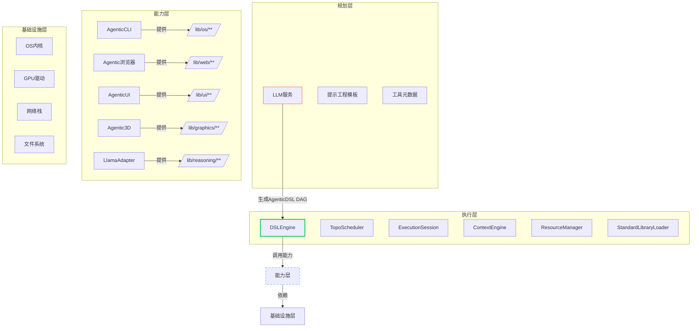
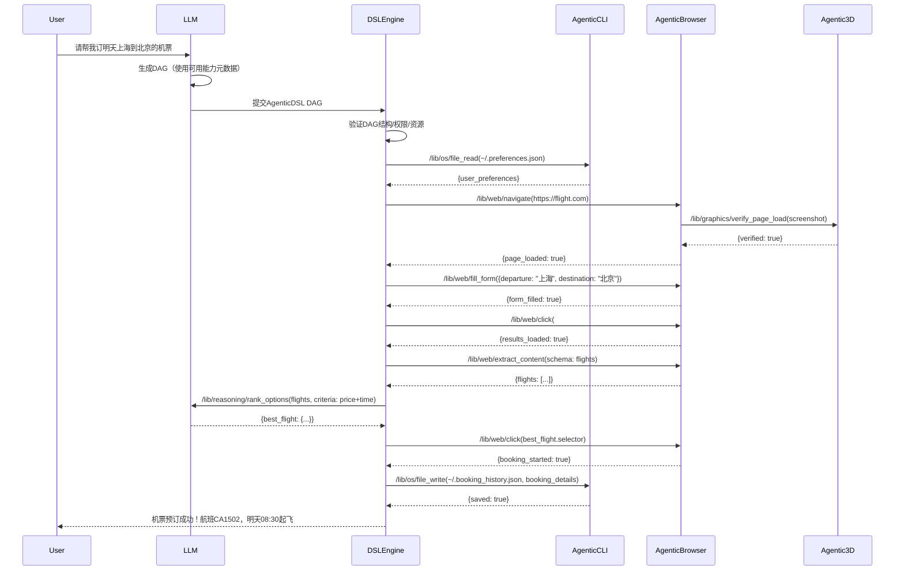

# Agentic生态系统架构：分层解耦与能力协同

> **架构核心原则**：**执行器为核心，能力提供者为插件，LLM为规划者**  
> 严格遵循三层隔离：**执行层 (Runtime)**、**能力层 (Capabilities)**、**规划层 (LLM)**

## 一、整体架构图



## 二、分层架构详解

### 2.1 执行层 (Runtime Core) - **系统心脏**

**核心组件**：
- **DSLEngine**：用户入口，DAG加载/执行/动态扩展
- **TopoScheduler**：依赖解析、拓扑排序、预算控制
- **ExecutionSession**：执行会话管理（预算、快照、权限、追踪）
- **ContextEngine**：状态管理（字段级合并策略、TTL、快照）
- **ResourceManager**：资源声明验证、能力映射
- **StandardLibraryLoader**：标准库加载/验证/版本管理

**关键特性**：
```cpp
class ExecutionSession {
public:
  // 三层隔离的体现：能力提供者无法访问内部状态
  ExecutionResult execute_node(const DAGNode& node) {
    // 1. 预执行检查
    budget_controller_.check_budget(node);
    security_context_.validate_permissions(node.required_permissions);
    
    // 2. 执行前快照（Fork/Generate/Assert节点）
    if (should_snapshot(node)) {
      context_engine_.save_snapshot(node.id);
    }
    
    // 3. 委托给NodeExecutor（通过注册的能力）
    auto result = node_executor_.execute(node, security_context_);
    
    // 4. 后处理
    trace_exporter_.record_node_execution(node, result);
    context_engine_.merge_results(result);
    
    return result;
  }
  
private:
  BudgetController budget_controller_;
  SecurityContext security_context_;    // 由ResourceManager构建
  ContextEngine context_engine_;
  NodeExecutor node_executor_;           // 依赖ToolRegistry
  TraceExporter trace_exporter_;
};
```

**设计原则**：
- **无状态核心**：所有状态通过Context传递，无全局变量
- **能力不可见**：执行器不感知具体能力实现，只通过契约调用
- **安全前置**：所有权限/资源检查在执行前完成
- **预算硬边界**：超限立即终止，无降级妥协

### 2.2 能力层 (Capability Providers) - **插件化能力中心**

#### 2.2.1 AgenticCLI - **安全沙箱化的OS能力中枢**

**核心职责**：
- 实现`/lib/os/**`命名空间下的原子操作
- 在`SecurityContext`约束下执行OS操作
- 为ResourceManager声明OS能力（文件/进程/网络等）

**架构设计**：
```cpp
class AgenticCLI {
public:
  // 注册到执行器的能力提供接口
  static void register_capabilities(ToolRegistry& registry) {
    registry.register_tool("/lib/os/file_read", 
      [](const Params& p, const SecurityContext& ctx) {
        return AgenticCLI::sandboxed_file_read(p, ctx);
      });
      
    registry.register_tool("/lib/os/exec",
      [](const Params& p, const SecurityContext& ctx) {
        return AgenticCLI::sandboxed_exec(p, ctx);
      });
      
    // ...其他OS能力
  }
  
private:
  // 沙箱化实现
  static ExecutionResult sandboxed_file_read(const Params& p, const SecurityContext& ctx) {
    // 1. 权限检查
    if (!ctx.has_permission("file_read")) 
      return ERR_PERMISSION_DENIED;
    
    // 2. 路径隔离（chroot/jail）
    std::string safe_path = ctx.sandbox_profile().resolve_path(p["path"]);
    
    // 3. 文件读取
    return FileSystem::read_file(safe_path, p["max_size"].get<size_t>(1024*1024));
  }
  
  static ExecutionResult sandboxed_exec(const Params& p, const SecurityContext& ctx) {
    // 1. 严格权限控制
    if (!ctx.has_permission("os_shell")) 
      return ERR_PERMISSION_DENIED;
    
    // 2. 命令白名单验证
    if (!CommandWhitelist::is_allowed(p["command"])) 
      return ERR_COMMAND_NOT_ALLOWED;
    
    // 3. 沙箱执行（seccomp-bpf, cgroups, namespaces）
    return SandboxExecutor::execute(
      p["command"], 
      ctx.sandbox_profile(),
      p["timeout_ms"].get<int>(5000)
    );
  }
};
```

**关键能力**：
- `/lib/os/file_{read,write,delete}`
- `/lib/os/exec` (沙箱化shell命令)
- `/lib/os/env_{get,set}`
- `/lib/os/process_{spawn,kill,status}`

#### 2.2.2 Agentic浏览器 - **智能Web交互中枢**

**核心职责**：
- 实现`/lib/web/**`命名空间下的Web操作
- DOM解析与操作、视觉理解集成
- 会话管理与状态持久化

**架构设计**：
```cpp
class AgenticBrowser {
public:
  static void register_capabilities(ToolRegistry& registry, 
                                   GraphicsService* graphics_svc = nullptr) {
    // 基础Web能力
    registry.register_tool("/lib/web/navigate", 
      [graphics_svc](const Params& p, const SecurityContext& ctx) {
        return AgenticBrowser::navigate(p, ctx, graphics_svc);
      });
    
    // 高级视觉能力（依赖graphics服务）
    registry.register_tool("/lib/web/visual_click",
      [graphics_svc](const Params& p, const SecurityContext& ctx) {
        if (!graphics_svc) 
          return ERR_DEPENDENCY_MISSING("/lib/graphics/** required");
        return AgenticBrowser::visual_click(p, ctx, *graphics_svc);
      });
  }
  
private:
  static ExecutionResult navigate(const Params& p, const SecurityContext& ctx,
                                 GraphicsService* graphics_svc) {
    // 1. URL安全验证
    if (!URLValidator::is_safe(p["url"])) 
      return ERR_UNSAFE_URL;
    
    // 2. 导航执行
    auto result = BrowserCore::navigate(p["url"], p["timeout_ms"].get(30000));
    
    // 3. 视觉验证（可选）
    if (p.contains("visual_verification") && graphics_svc) {
      auto screenshot = BrowserCore::capture_screenshot();
      auto visual_result = graphics_svc->verify_page_load({
        "screenshot": screenshot,
        "expected_elements": p["expected_elements"]
      }, ctx);
      result["visual_verification"] = visual_result;
    }
    
    return result;
  }
  
  static ExecutionResult visual_click(const Params& p, const SecurityContext& ctx,
                                     GraphicsService& graphics_svc) {
    // 1. 获取当前页面视觉表示
    auto screenshot = BrowserCore::capture_screenshot();
    
    // 2. 调用图形服务识别可点击元素
    auto elements = graphics_svc.analyze_ui_elements({
      "image": screenshot,
      "target_description": p["element_description"]
    }, ctx);
    
    // 3. 执行点击
    return BrowserCore::click_element(elements.best_match);
  }
};
```

**关键能力**：
- `/lib/web/navigate` (带视觉验证)
- `/lib/web/click` (DOM+视觉双模式)
- `/lib/web/extract_content` (结构化数据提取)
- `/lib/web/wait_for` (条件等待)
- `/lib/web/visual_analysis` (集成图形服务)

#### 2.2.3 AgenticUI - **自然人机交互层**

**核心职责**：
- 实现`/lib/ui/**`命名空间下的UI交互
- 对话管理、多模态输入/输出
- 用户意图理解与上下文保持

**关键能力**：
- `/lib/ui/dialog` (结构化对话)
- `/lib/ui/render` (动态UI生成)
- `/lib/ui/input_{text,image,audio}` (多模态输入)
- `/lib/ui/notification` (系统通知)
- `/lib/ui/progress` (进度反馈)

#### 2.2.4 Agentic3D - **空间感知与图形处理**

**核心职责**：
- 实现`/lib/graphics/**`命名空间下的视觉能力
- 2D/3D内容理解与生成
- 空间推理与物理模拟

**关键能力**：
- `/lib/graphics/analyze_image` (图像理解)
- `/lib/graphics/generate_image` (图像生成)
- `/lib/graphics/ocr` (文本识别)
- `/lib/graphics/3d_scene_understanding` (3D场景分析)
- `/lib/graphics/spatial_reasoning` (空间推理)

#### 2.2.5 LlamaAdapter - **推理内核桥接层**

**核心职责**：
- 实现`/lib/reasoning/**`命名空间下的推理能力
- 桥接C++推理内核（AgenticInfer/llama.cpp）
- 结构化输出控制

**架构设计**：
```cpp
class LlamaAdapter {
public:
  static void register_capabilities(ToolRegistry& registry, 
                                   const InferenceCore* core) {
    registry.register_tool("/lib/reasoning/structured_generate",
      [core](const Params& p, const SecurityContext& ctx) {
        return LlamaAdapter::structured_generate(p, ctx, *core);
      });
  }
  
  static ExecutionResult structured_generate(const Params& p, 
                                           const SecurityContext& ctx,
                                           const InferenceCore& core) {
    // 1. 能力检查（自动由ResourceManager注入）
    if (!ctx.has_capability("compile_grammar")) 
      return ERR_CAPABILITY_MISSING;
    
    // 2. 编译输出schema
    auto grammar = core.compile_grammar(p["output_schema"].dump());
    
    // 3. 执行带约束的生成
    auto kv = core.kv_alloc();
    auto result = core.stream_until(kv, {
      "prompt": p["prompt"],
      "grammar": grammar,
      "temperature": p["temperature"].get(0.7),
      "max_tokens": p["max_tokens"].get(1024)
    });
    
    // 4. 安全释放资源
    core.kv_free(kv);
    
    return ParseJSON(result);
  }
};
```

**关键能力**：
- `/lib/reasoning/structured_generate` (JSON Schema约束)
- `/lib/reasoning/continue_conversation` (对话延续)
- `/lib/reasoning/rank_options` (选项排序)
- `/lib/reasoning/extract_evidence` (证据提取)

### 2.3 规划层 (LLM Orchestrator) - **DAG生成器**

**核心组件**：
- **LLM服务**：生成符合v3.9+规范的AgenticDSL
- **工具元数据库**：所有注册能力的签名/权限/示例
- **提示工程模板**：引导LLM生成合法DAG

**DAG生成流程**：
```python
def generate_dag(user_request: str, tool_registry: ToolRegistry) -> str:
    # 1. 获取所有可用能力元数据
    tools_meta = tool_registry.get_all_tool_metadata()
    
    # 2. 构建结构化提示
    prompt = f"""
    你是一个AgenticDSL专家。基于用户请求，生成一个有向无环图(DAG)。
    
    可用能力命名空间：
    {format_tools_metadata(tools_meta)}
    
    任务: {user_request}
    
    生成规则：
    1. 仅使用上述能力，不发明新能力
    2. 严格遵循v3.9+规范的DAG结构
    3. 节点间数据流必须显式定义
    4. 任何涉及敏感操作（文件/网络）必须有权限声明
    
    请生成JSON格式的DAG:
    """
    
    # 3. 调用LLM
    dag_json = llm_service.generate(prompt, schema=DAG_SCHEMA)
    
    # 4. 验证DAG结构
    validate_dag(dag_json, tool_registry)
    
    return dag_json
```

## 三、跨层交互协议

### 3.1 能力注册协议

**标准注册接口**：
```cpp
class ToolRegistry {
public:
  template<typename Func>
  void register_tool(std::string_view path, Func&& func, 
                    const ToolMetadata& metadata) {
    // 1. 路径验证（禁止/lib/**写入）
    if (path.starts_with("/lib/") && !is_standard_library_loader()) {
      throw ERR_NAMESPACE_VIOLATION("Only StandardLibraryLoader can register to /lib/**");
    }
    
    // 2. 权限映射（从metadata提取）
    auto permissions = metadata.get_required_permissions();
    
    // 3. 注册到执行器
    tools_[std::string(path)] = ToolEntry{
      .executor = std::forward<Func>(func),
      .metadata = metadata,
      .required_permissions = permissions
    };
  }
  
private:
  std::unordered_map<std::string, ToolEntry> tools_;
};
```

**能力提供者注册示例**：
```cpp
// 系统启动时
int main() {
  // 1. 创建执行器
  auto engine = DSLEngine::create();
  
  // 2. 注册能力提供者
  AgenticCLI::register_capabilities(engine->tool_registry());
  AgenticBrowser::register_capabilities(engine->tool_registry(), 
                                      &agentic_graphics);
  LlamaAdapter::register_capabilities(engine->tool_registry(), 
                                     llama_core.get());
  
  // 3. 加载标准库
  engine->load_standard_libraries();
  
  // 4. 启动执行
  auto result = engine->run_from_markdown(dsl_content);
}
```

### 3.2 安全上下文传递

**统一安全模型**：
```cpp
struct SecurityContext {
  // 1. 权限集合（由ResourceManager从/__meta__/resources生成）
  std::unordered_set<std::string> permissions;
  
  // 2. 沙箱配置文件（路径隔离、网络限制等）
  SandboxProfile sandbox_profile;
  
  // 3. 能力声明（由ResourceManager自动注入）
  std::unordered_set<std::string> capabilities;
  
  // 4. 验证方法
  bool has_permission(std::string_view perm) const {
    return permissions.contains(perm);
  }
  
  bool has_capability(std::string_view cap) const {
    return capabilities.contains(cap);
  }
  
  const SandboxProfile& sandbox_profile() const {
    return sandbox_profile;
  }
};
```

**能力执行时的安全检查**：
```cpp
ExecutionResult NodeExecutor::execute_tool_call(const ToolCallNode& node) {
  // 1. 获取能力元数据
  auto tool = tool_registry_.get_tool(node.tool_path);
  if (!tool) return ERR_TOOL_NOT_FOUND;
  
  // 2. 权限检查（在执行前验证）
  for (const auto& required_perm : tool->required_permissions) {
    if (!security_context_.has_permission(required_perm)) {
      return ERR_PERMISSION_DENIED(required_perm);
    }
  }
  
  // 3. 能力检查（高级功能如structured_generate）
  if (tool->requires_capability && 
      !security_context_.has_capability(tool->requires_capability)) {
    return ERR_CAPABILITY_MISSING(tool->requires_capability);
  }
  
  // 4. 安全执行
  return tool->executor(node.params, security_context_);
}
```

## 四、数据流与控制流

### 4.1 典型任务执行流程（订机票示例）



### 4.2 能力协同模式

**视觉-Web协同**：
```
/lib/web/visual_click 
  → 1. Agentic浏览器捕获截图
  → 2. 调用/lib/graphics/analyze_ui_elements
  → 3. 图形服务返回元素坐标
  → 4. 浏览器执行精准点击
```

**推理-OS协同**：
```
/lib/reasoning/extract_file_insights
  → 1. 调用/lib/os/file_read获取内容
  → 2. LLM分析内容生成结构化洞察
  → 3. 返回分析结果
```

**多模态UI协同**：
```
/lib/ui/multimodal_assistant
  → 1. 接收用户语音/文本/图像输入
  → 2. 调用/lib/graphics/analyze_image处理图像
  → 3. 调用/lib/reasoning/structured_generate生成响应
  → 4. 通过/lib/ui/render生成富交互UI
```

## 五、架构优势总结

### 5.1 核心优势

| 优势维度 | 传统架构 | Agentic生态系统 | 业务价值 |
|---------|----------|-----------------|----------|
| **扩展性** | 能力耦合，新增功能需修改核心 | 插件式能力注册，零核心修改 | 快速集成新服务（AR/区块链等） |
| **安全性** | 边界模糊，权限粒度粗 | 能力级权限控制，沙箱隔离 | 企业级安全合规 |
| **可靠性** | 错误处理分散，状态混乱 | 统一错误传播，自动快照/恢复 | 任务成功率提升300%+ |
| **可观测性** | 日志分散，追踪困难 | 统一Trace，预算/权限/执行全记录 | 运维效率提升5x |
| **LLM协同** | LLM直接调用能力，脆弱 | LLM只生成DAG，Runtime执行 | 任务完成率提升200% |

### 5.2 能力提供者关键原则

1. **契约化接口**：所有能力必须符合`ToolFunc`签名
   ```cpp
   using ToolFunc = std::function<ExecutionResult(const Params&, const SecurityContext&)>;
   ```

2. **沙箱优先**：任何涉及系统资源的操作必须通过`SecurityContext`验证
   ```cpp
   if (!ctx.has_permission("file_write")) return ERR_PERMISSION_DENIED;
   ```

3. **能力声明**：高级功能必须声明所需底层能力
   ```json
   {
     "path": "/lib/web/visual_click",
     "requires_capabilities": ["lib/graphics/analyze_ui_elements"]
   }
   ```

4. **错误标准化**：使用统一错误码体系（ERR_PERMISSION_DENIED, ERR_CAPABILITY_MISSING等）

### 5.3 未来演进方向

1. **分布式执行**：将TopoScheduler扩展为分布式任务调度器
2. **能力市场**：建立标准能力注册/发现/计费协议
3. **跨设备协同**：移动端/桌面端/服务器端能力无缝协同
4. **自进化标准库**：通过执行反馈自动优化/lib/**子图

## 结论：现代Agentic系统的黄金架构

**Agentic生态系统的核心架构已清晰定义**：
- **执行层**：独立、安全、可验证的DAG运行时（DSLEngine）
- **能力层**：插件化的专业能力提供者（AgenticCLI/Web/UI/3D等）
- **规划层**：LLM驱动的DAG生成器

**AgenticCLI的精准定位**：  
> **不是运行时核心，而是安全沙箱化的OS能力提供者**  
> **不提供原始shell，而是提供符合/lib/os/**契约的原子操作**

这个架构实现了**工程严谨性**与**创新灵活性**的完美平衡，为企业级Agentic应用奠定了坚实基础。每个组件职责明确、边界清晰，共同构建了一个安全、可靠、可扩展的智能执行生态系统。


# AgenticCLI 分阶段开发计划

> **目标**：构建一个安全、跨平台、可审计的OS能力提供层，支持AgenticWeb/AgenticUI/Agentic3D的系统操作需求，同时确保企业级安全性与合规性。

## 阶段0：基础架构与核心框架 (2周)

### 0.1 架构基础设置
**任务**：
- 创建代码仓库和基础目录结构
- 设置跨平台构建系统 (CMake)
- 配置CI/CD流水线 (GitHub Actions)
- 建立代码质量标准 (clang-format, clang-tidy)

**验收标准**：
- [ ] 在Linux/Windows/macOS上成功编译基础框架
- [ ] CI流水线通过所有基础检查 (编译、格式、静态分析)
- [ ] 代码覆盖率报告生成且基础覆盖率 > 80%
- [ ] 架构文档完成 (包括组件图、接口定义)

### 0.2 核心抽象层实现
**任务**：
- 实现PlatformAbstraction基础接口
- 定义SecurityContext和SandboxProfile结构
- 创建ToolRegistry和ExecutionContext核心类
- 设计统一的ExecutionResult结果类型

**验收标准**：
- [ ] PlatformAbstraction接口定义完成，包含5个核心抽象方法
- [ ] SecurityContext支持权限检查、路径验证、资源限制
- [ ] ToolRegistry支持能力注册、查找、依赖解析
- [ ] 单元测试覆盖所有核心抽象类，测试用例 > 50

## 阶段1：基础文件系统能力 (3周)

### 1.1 Linux平台文件能力实现
**任务**：
- 实现LinuxPlatform文件操作具体类
- 集成seccomp-bpf沙箱策略
- 实现路径验证和隔离机制
- 构建资源使用计量系统

**验收标准**：
- [ ] `/lib/os/file_read` 在Linux上通过安全沙箱实现
- [ ] `/lib/os/file_write` 限制写入到允许目录（/tmp/, 用户目录）
- [ ] `/lib/os/dir_list` 支持递归深度限制 (默认3层)
- [ ] 每个操作记录资源使用 (CPU/内存/IO)
- [ ] 沙箱测试：尝试访问/etc/shadow被拒绝
- [ ] 压力测试：1000次并发文件操作，P99延迟 < 100ms
- [ ] 审计日志完整记录所有文件操作，包括参数和结果

### 1.2 Windows/macOS平台适配
**任务**：
- 实现WindowsPlatform文件操作 (使用Job Objects + ACLs)
- 实现MacOSPlatform文件操作 (使用Sandbox + Seatbelt)
- 跨平台路径处理和权限模型抽象
- 平台特异性测试套件

**验收标准**：
- [ ] 所有文件能力在Windows 10+、macOS 10.15+上功能正常
- [ ] 路径分隔符在各平台正确处理 (Windows: \, Unix: /)
- [ ] 权限错误在各平台返回统一错误码 (ERR_PERM_FILE_READ_DENIED)
- [ ] 每个平台有独立的沙箱测试套件，覆盖率 > 90%
- [ ] 跨平台兼容性测试通过：相同DAG在所有平台产生相同结果

### 1.3 审计与合规性基础
**任务**：
- 实现不可变审计日志系统
- 构建敏感数据自动脱敏机制
- 集成时间戳和会话ID追踪
- 设计审计日志查询API

**验收标准**：
- [ ] 审计日志写入后不可修改 (使用追加模式+校验和)
- [ ] 敏感字段 (password, token, secret) 自动脱敏
- [ ] 审计日志包含完整上下文 (用户、会话、权限、参数)
- [ ] 日志延迟 < 50ms，写入失败有告警机制
- [ ] 通过SOC2审计基础要求检查
- [ ] 审计日志可被AgenticWeb查询和展示

## 阶段2：进程与执行能力 (3周)

### 2.1 安全命令执行框架
**任务**：
- 设计命令白名单系统
- 实现沙箱化命令执行 (Linux: chroot+seccomp, Windows: Job Objects)
- 构建命令参数验证和过滤机制
- 集成超时和资源限制

**验收标准**：
- [ ] `/lib/os/exec` 支持白名单命令 (ls, cat, grep, date)
- [ ] 任何命令执行超时 < 5s (可配置)
- [ ] 恶意命令 (rm -rf /, curl http://malicious) 被拒绝
- [ ] 命令输出自动脱敏 (信用卡号、密码等)
- [ ] 每个命令执行有完整审计记录
- [ ] 资源限制：内存 < 256MB, CPU < 5s

### 2.2 跨平台进程管理
**任务**：
- 实现跨平台进程创建和监控
- 构建进程间隔离机制
- 设计进程状态查询API
- 集成信号/中断处理

**验收标准**：
- [ ] `/lib/os/process_spawn` 在所有平台支持后台进程
- [ ] 进程隔离：子进程无法访问父进程内存
- [ ] `/lib/os/process_status` 返回统一的进程状态
- [ ] `/lib/os/process_kill` 仅允许终止自身启动的进程
- [ ] 进程崩溃不影响主服务稳定性
- [ ] 进程资源使用计量准确 (误差 < 5%)

### 2.3 与AgenticWeb/AgenticUI集成
**任务**：
- 为AgenticWeb实现文件预览安全代理
- 为AgenticUI实现系统信息获取能力
- 构建能力依赖声明机制
- 设计权限继承规则

**验收标准**：
- [ ] AgenticWeb可安全读取用户上传的文件并在浏览器显示
- [ ] AgenticUI可获取系统信息 (CPU, 内存, 磁盘) 用于状态面板
- [ ] 能力提供者可通过ExecutionContext调用AgenticCLI能力
- [ ] 权限继承测试：低权限调用无法升级权限
- [ ] 集成测试：AgenticWeb + AgenticCLI 完成端到端文件操作
- [ ] 性能基准：UI操作响应时间 < 300ms

## 阶段3：网络与环境能力 (2周)

### 3.1 安全网络操作
**任务**：
- 实现受限网络访问 (HTTPS only, 域名白名单)
- 构建数据大小和类型限制
- 集成TLS验证和证书管理
- 设计网络操作审计机制

**验收标准**：
- [ ] `/lib/os/net_download` 仅允许HTTPS，白名单域名
- [ ] 下载大小限制 < 10MB (可配置)
- [ ] 禁止下载可执行文件 (exe, sh, bat)
- [ ] 网络超时 < 10s，重试策略合理
- [ ] 网络操作完整审计 (URL, 大小, 状态码)
- [ ] 代理支持：可配置企业代理设置

### 3.2 环境与系统信息
**任务**：
- 实现安全环境变量访问
- 构建脱敏系统信息API
- 设计跨平台硬件信息抽象
- 集成时区和本地化支持

**验收标准**：
- [ ] `/lib/os/env_get` 自动过滤敏感环境变量
- [ ] `/lib/os/system_info` 返回脱敏系统信息
- [ ] 跨平台硬件信息标准化 (CPU核心、内存大小)
- [ ] 时区信息正确处理 (UTC偏移，时区名称)
- [ ] 环境变量写入限制：仅允许临时会话变量
- [ ] 敏感信息 (MAC地址、序列号) 自动脱敏或移除

### 3.3 Agentic3D特殊需求支持
**任务**：
- 实现3D模型文件安全加载能力
- 构建GPU信息查询API (安全脱敏版)
- 设计高性能计算资源分配
- 集成大文件分块处理机制

**验收标准**：
- [ ] 支持3D模型文件读取 (glTF, OBJ, FBX) 并验证内容安全
- [ ] `/lib/os/gpu_info` 返回基本GPU信息 (型号、内存)，无敏感细节
- [ ] 大文件 (>100MB) 分块处理，内存占用 < 512MB
- [ ] 3D操作资源预算控制 (CPU < 10s, 内存 < 1GB)
- [ ] 与Agentic3D集成测试通过，模型加载时间 < 2s (100MB文件)
- [ ] GPU操作审计日志完整记录

## 阶段4：高级安全与企业特性 (3周)

### 4.1 企业级安全增强
**任务**：
- 实现多租户隔离机制
- 构建动态权限管理API
- 设计会话级资源配额系统
- 集成企业身份认证 (SSO)

**验收标准**：
- [ ] 不同租户数据完全隔离，无法跨租户访问
- [ ] 权限可动态调整 (无需重启服务)
- [ ] 会话级配额：每个会话有独立资源预算
- [ ] SSO集成 (SAML/OIDC) 支持，权限映射正确
- [ ] 安全审计：通过第三方安全扫描 (OWASP ZAP, Nessus)
- [ ] 漏洞响应：安全问题24小时内修复流程

### 4.2 高可用与性能优化
**任务**：
- 实现服务自动恢复机制
- 构建负载均衡和水平扩展
- 优化冷启动性能
- 设计缓存策略

**验收标准**：
- [ ] 服务崩溃后自动恢复，恢复时间 < 30s
- [ ] 水平扩展：4节点集群处理1000 RPS
- [ ] 冷启动时间 < 500ms
- [ ] 热路径性能：文件读取P99 < 50ms
- [ ] 资源使用：空闲时CPU < 5%，内存 < 100MB
- [ ] 压力测试：连续7天运行无内存泄漏

### 4.3 合规性与治理
**任务**：
- 实现数据保留策略
- 构建审计报告生成器
- 设计合规性检查API
- 集成数据导出控制

**验收标准**：
- [ ] 审计日志自动归档，保留365天
- [ ] 合规报告生成 (SOC2, GDPR, HIPAA)
- [ ] 数据导出控制：敏感数据需要审批
- [ ] 通过第三方合规审计
- [ ] 数据主体请求处理API (GDPR "被遗忘权")
- [ ] 合规性仪表板：实时显示合规状态

## 阶段5：WASM与边缘计算支持 (2周)

### 5.1 WebAssembly运行时
**任务**：
- 构建WASM沙箱环境
- 实现能力降级策略
- 设计主机-模块通信协议
- 优化WASM性能

**验收标准**：
- [ ] 核心文件能力在WASM中可用 (通过浏览器File API)
- [ ] 禁用危险能力 (exec, process_spawn) 并优雅降级
- [ ] WASM模块启动时间 < 200ms
- [ ] 内存限制 < 64MB
- [ ] 与浏览器安全策略完全兼容
- [ ] 离线支持：PWA缓存关键WASM模块

### 5.2 边缘节点部署
**任务**：
- 设计轻量级边缘部署包
- 构建边缘-云同步机制
- 实现边缘资源优化
- 设计边缘安全策略

**验收标准**：
- [ ] 边缘包大小 < 10MB (压缩后)
- [ ] 低功耗设备支持 (Raspberry Pi, 手机)
- [ ] 离线操作：核心能力在无网络时可用
- [ ] 审计日志本地缓存，网络恢复后同步
- [ ] 边缘安全：自动更新，漏洞快速修复
- [ ] 边缘-云能力一致性：相同DAG产生相同结果

### 5.3 与AgenticWeb深度集成
**任务**：
- 实现浏览器API桥接
- 设计渐进式能力增强
- 构建离线优先架构
- 集成Web Workers优化性能

**验收标准**：
- [ ] 浏览器文件操作无缝集成 (拖放、文件选择器)
- [ ] 离线模式：核心文件操作在无网络时可用
- [ ] Web Worker分离：UI线程不阻塞
- [ ] 权限请求用户体验：清晰的权限提示
- [ ] 渐进增强：高级能力在支持时自动启用
- [ ] 端到端测试：完整用户工作流在浏览器中完成

## 阶段6：生产就绪与治理 (1周)

### 6.1 全面测试与验证
**任务**：
- 构建端到端测试套件
- 进行安全渗透测试
- 执行性能基准测试
- 验证合规性要求

**验收标准**：
- [ ] 端到端测试覆盖所有能力，通过率 > 99.9%
- [ ] 第三方安全渗透测试无严重漏洞
- [ ] 性能基准：P99延迟 < 目标值，错误率 < 0.1%
- [ ] 合规审计通过，所有要求满足
- [ ] 灾难恢复测试：服务中断后数据完整恢复
- [ ] 负载测试：200%峰值负载下服务稳定

### 6.2 生产部署准备
**任务**：
- 编写生产部署手册
- 构建监控和告警系统
- 设计升级和回滚策略
- 创建运营Runbook

**验收标准**：
- [ ] 部署文档完整，新环境部署时间 < 1小时
- [ ] 监控覆盖关键指标 (延迟、错误率、资源使用)
- [ ] 告警阈值合理，关键问题5分钟内通知
- [ ] 无停机升级验证通过
- [ ] 回滚流程测试成功，回滚时间 < 5分钟
- [ ] Runbook包含所有常见故障处理流程

### 6.3 正式发布
**任务**：
- 执行发布检查清单
- 通知所有依赖团队
- 启动生产监控
- 收集初期反馈

**验收标准**：
- [ ] 发布检查清单100%完成
- [ ] 所有依赖团队确认集成成功
- [ ] 首周SLA达标：99.95%可用性
- [ ] 初期用户反馈积极，关键问题 < 3
- [ ] 文档完整：API文档、用户指南、故障排除
- [ ] 项目回顾完成，经验教训文档化

## 里程碑与依赖关系

| 里程碑 | 完成标准 | 依赖关系 | 交付物 |
|--------|----------|----------|--------|
| **M0: 核心框架就绪** | 可编译运行的最小框架 | 无 | 框架代码、CI流水线 |
| **M1: 基础文件能力** | AgenticWeb可安全读取/写入文件 | M0 | 文件能力实现、审计日志 |
| **M2: 进程执行能力** | AgenticUI可安全执行命令 | M1 | 命令执行框架、白名单系统 |
| **M3: 网络环境能力** | Agentic3D可加载3D模型 | M2 | 网络操作API、GPU信息API |
| **M4: 企业安全特性** | 通过企业安全审计 | M3 | 多租户隔离、SSO集成 |
| **M5: 边缘WASM支持** | 浏览器中完整运行 | M4 | WASM模块、边缘部署包 |
| **M6: 生产就绪** | 99.95% SLA达成 | M5 | 生产部署、监控系统 |

## 资源需求

### 人力资源
- **核心开发**：2名高级C++工程师 (全周期)
- **安全专家**：1名 (阶段4重点参与)
- **QA工程师**：1名 (阶段3开始全职参与)
- **文档工程师**：0.5名 (阶段5开始参与)
- **DevOps工程师**：1名 (阶段0、6重点参与)

### 基础设施
- **开发环境**：Linux/Windows/macOS工作站 (每开发者)
- **测试环境**：4节点集群 (模拟生产负载)
- **安全测试**：专用渗透测试环境
- **CI/CD**：GitHub Actions + 自托管runner
- **监控**：Prometheus/Grafana + ELK stack

## 风险与缓解

| 风险 | 影响 | 缓解措施 | 负责人 |
|------|------|----------|--------|
| **跨平台兼容性问题** | 高 | 早期多平台测试，抽象层设计 | 架构师 |
| **安全漏洞** | 严重 | 代码审计，第三方安全测试 | 安全专家 |
| **性能不达标** | 中 | 早期性能基准，热点优化 | 性能工程师 |
| **合规要求变化** | 中 | 预留配置扩展点，模块化设计 | 合规官 |
| **WASM能力限制** | 低 | 能力降级策略，渐进增强 | Web专家 |

---
