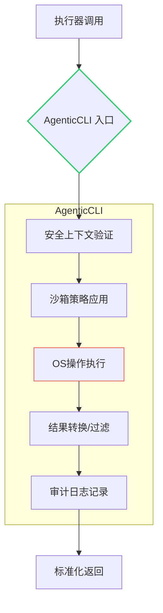
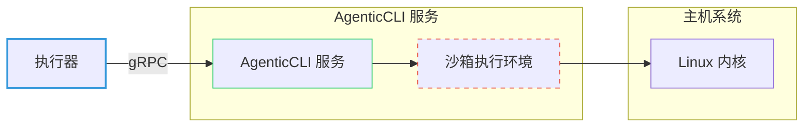
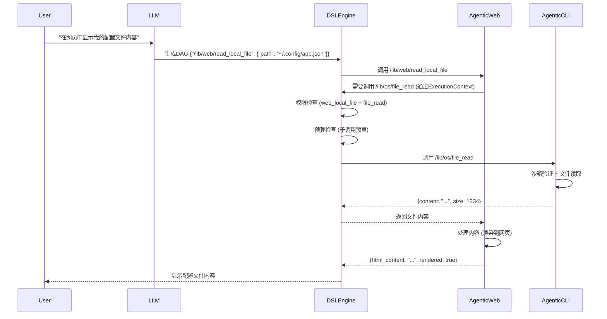

# AgenticCLI 架构文档 v1.0

> **文档目标**：定义 AgenticCLI 作为安全沙箱化 OS 能力提供者的架构规范，明确其与 AgenticDSL 执行器的集成边界，确保在企业级环境中提供**可信、隔离、可审计**的系统操作能力。

## 1. 核心定位与边界

### 1.1 精准定位
```
┌───────────────────────────────────────────────────────┐
│                  Agentic生态系统                      │
│                                                       │
│  ┌──────────────┐    ┌──────────────┐    ┌───────────┐│
│  │  执行层      │    │  能力层       │    │ 规划层    ││
│  │ (Runtime)   │◄───┤ (Capabilities)│    │  (LLM)   ││
│  └──────────────┘    └──────────────┘    └───────────┘│
│        ▲                     ▲                        │
│        │                     │                        │
│  ┌──────────────┐    ┌───────┴────────┐               │
│  │ DSLEngine    │    │  AgenticCLI    │               │
│  │ TopoScheduler│    │  (本组件)      │               │
│  └──────────────┘    └────────────────┘               │
└───────────────────────────────────────────────────────┘
```

**关键声明**：
- ✅ **AgenticCLI 是能力提供者**，不是执行核心
- ✅ **提供 `/lib/os/**` 命名空间下的原子 OS 操作**
- ✅ **所有操作在安全沙箱中执行，受执行器统一管控**
- ❌ **不直接暴露原始 shell 接口**
- ❌ **不管理 DAG 调度/状态/快照**

### 1.2 与其他组件的关系

| 关联组件 | 交互方式 | 依赖方向 | 关键接口 |
|---------|----------|----------|----------|
| **DSLEngine** | 能力注册/调用 | AgenticCLI → DSLEngine | `ToolRegistry::register_tool()` |
| **Agentic浏览器** | 能力协同 | 双向 (通过执行器) | 共享 `/lib/fs/**` 能力 |
| **LlamaAdapter** | 数据交换 | AgenticCLI → LlamaAdapter | 文件内容 → 结构化分析 |
| **基础设施** | 资源使用 | AgenticCLI → OS | syscalls, libc, seccomp |

## 2. 设计原则

### 2.1 核心原则
1. **沙箱优先 (Sandbox-First)**  
   任何 OS 操作必须在执行前通过安全上下文验证，沙箱策略由执行器定义
   
2. **契约化能力 (Contractual Capabilities)**  
   每个能力必须明确定义输入/输出 schema、所需权限、错误码

3. **能力最小化 (Least Capability)**  
   每个工具函数仅暴露必要功能，避免"全能型"接口

4. **审计完整性 (Audit Completeness)**  
   所有操作必须记录完整审计日志，包括参数、结果、权限上下文

5. **故障隔离 (Failure Isolation)**  
   单个操作失败不应影响其他能力或执行器稳定性

### 2.2 反模式避免
- **❌ 避免全局状态**：不依赖跨调用的全局变量
- **❌ 避免能力透传**：不将原始 OS 句柄返回给执行层
- **❌ 避免权限膨胀**：不请求超出工具声明的权限
- **❌ 避免同步阻塞**：长时间操作必须支持超时/取消

## 3. 架构组件

### 3.1 高层次架构



### 3.2 核心组件详解

#### 3.2.1 CapabilityRegistry (能力注册中心)
**职责**：向执行器注册所有 OS 能力，提供元数据

```cpp
class CapabilityRegistry {
public:
  static void register_capabilities(ToolRegistry& registry) {
    // 文件操作能力
    registry.register_tool("/lib/os/file_read", 
      file_read_executor,
      ToolMetadata{
        .description = "安全读取文件内容",
        .required_permissions = {"file_read"},
        .input_schema = R"({
          "type": "object",
          "properties": {
            "path": {"type": "string", "description": "文件路径"},
            "max_size": {"type": "integer", "default": 1048576, "description": "最大读取字节数"}
          },
          "required": ["path"]
        })",
        .output_schema = R"({
          "type": "object",
          "properties": {
            "content": {"type": "string", "description": "文件内容"},
            "size": {"type": "integer", "description": "实际读取字节数"}
          }
        })"
      });
    
    // 其他能力注册...
  }
  
private:
  static ExecutionResult file_read_executor(const Params& params, 
                                          const SecurityContext& ctx);
};
```

**关键特性**：
- 所有能力在初始化时静态注册
- 每个能力附带完整的 JSON Schema
- 明确声明所需权限集
- 版本化元数据（支持 `/lib/os/file_read@v2`）

#### 3.2.2 SandboxEngine (沙箱引擎)
**职责**：在安全上下文中执行 OS 操作，提供多层隔离

```cpp
class SandboxEngine {
public:
  static ExecutionResult execute_in_sandbox(
    const std::string& operation,
    const Params& params,
    const SecurityContext& ctx,
    std::function<ExecutionResult()> unsafe_operation) 
  {
    // 1. 沙箱策略加载
    auto profile = ctx.sandbox_profile();
    
    // 2. 路径隔离（chroot/jail）
    if (params.contains("path")) {
      std::string safe_path = profile.resolve_path(params["path"]);
      if (safe_path.empty()) 
        return ERR_PATH_VIOLATION(params["path"]);
      
      // 替换为安全路径
      Params safe_params = params;
      safe_params["path"] = safe_path;
      return execute_with_profile(safe_params, profile, unsafe_operation);
    }
    
    // 3. 通用沙箱执行
    return execute_with_profile(params, profile, unsafe_operation);
  }
  
private:
  static ExecutionResult execute_with_profile(
    const Params& params,
    const SandboxProfile& profile,
    std::function<ExecutionResult()> unsafe_operation) 
  {
    // 应用多层沙箱策略
    SandboxGuard guard(profile);  // RAII 风格沙箱
    
    // 资源限制
    set_resource_limits(profile);
    
    // 信号处理
    setup_signal_handlers();
    
    // 4. 执行操作（带超时）
    return execute_with_timeout(unsafe_operation, profile.timeout_ms);
  }
};
```

**沙箱层级**：
| 层级 | 技术实现 | 保护范围 |
|------|----------|----------|
| **L1: 路径隔离** | chroot, namespace mounts | 文件系统访问 |
| **L2: 系统调用过滤** | seccomp-bpf | 禁止危险 syscalls |
| **L3: 资源限制** | cgroups, rlimit | CPU/内存/IO 限制 |
| **L4: 网络隔离** | network namespaces, iptables | 网络访问控制 |
| **L5: 能力限制** | Linux capabilities | 特权操作限制 |

#### 3.2.3 CapabilityExecutor (能力执行器)
**职责**：实现具体 OS 操作，处理错误转换，结果标准化

```cpp
class CapabilityExecutor {
public:
  static ExecutionResult file_read(const Params& params, const SecurityContext& ctx) {
    // 1. 验证参数
    if (!params.contains("path")) 
      return ERR_MISSING_PARAMETER("path");
    
    // 2. 沙箱中执行
    return SandboxEngine::execute_in_sandbox(
      "file_read", 
      params, 
      ctx,
      [&]() -> ExecutionResult {
        // 3. 实际文件读取
        std::string path = params["path"];
        size_t max_size = params.value("max_size", 1048576);
        
        std::ifstream file(path, std::ios::binary);
        if (!file.is_open()) 
          return ERR_FILE_NOT_FOUND(path);
        
        // 4. 限制读取大小
        std::string content;
        content.resize(std::min<size_t>(max_size, file_size(path)));
        file.read(&content[0], content.size());
        
        // 5. 结果标准化
        return {
          {"content", content},
          {"size", static_cast<int64_t>(file.gcount())},
          {"truncated", file.gcount() < file_size(path)}
        };
      }
    );
  }
  
  static ExecutionResult exec_command(const Params& params, const SecurityContext& ctx) {
    // 1. 严格命令验证
    std::string command = params["command"];
    if (!CommandWhitelist::is_allowed(command, ctx)) 
      return ERR_COMMAND_NOT_ALLOWED(command);
    
    // 2. 沙箱执行
    return SandboxEngine::execute_in_sandbox(
      "exec_command",
      params,
      ctx,
      [&]() -> ExecutionResult {
        // 3. 命令执行（使用posix_spawn避免shell注入）
        auto result = CommandRunner::run(
          command,
          params.value("args", std::vector<std::string>()),
          params.value("env", std::unordered_map<std::string, std::string>()),
          params.value("timeout_ms", 5000)
        );
        
        // 4. 敏感数据过滤
        if (params.value("sanitize_output", true)) {
          result.output = DataSanitizer::sanitize(result.output);
        }
        
        return result.to_json();
      }
    );
  }
  
  // 其他能力实现...
};
```

**关键特性**：
- 每个能力函数是纯函数（无状态）
- 统一错误处理（转换为标准错误码）
- 敏感数据自动过滤（密码、密钥等）
- 资源使用计量（字节/时间/调用次数）

#### 3.2.4 AuditLogger (审计日志器)
**职责**：记录所有操作的完整审计轨迹

```cpp
class AuditLogger {
public:
  static void log_operation(
    const std::string& operation,
    const Params& params,
    const ExecutionResult& result,
    const SecurityContext& ctx,
    const std::string& session_id) 
  {
    AuditRecord record{
      .timestamp = std::chrono::system_clock::now(),
      .operation = operation,
      .session_id = session_id,
      .user_identity = ctx.user_identity(),
      .permissions_used = ctx.effective_permissions(),
      .params = sanitize_params(params),  // 敏感参数过滤
      .result_status = result.is_success() ? "success" : "failure",
      .error_code = result.is_success() ? "" : result.error().code,
      .execution_time_ms = result.execution_time_ms,
      .resource_usage = {
        .cpu_ms = result.resource_usage().cpu_ms,
        .memory_bytes = result.resource_usage().peak_memory,
        .io_bytes = result.resource_usage().io_bytes
      }
    };
    
    // 异步写入审计日志
    AuditQueue::instance().enqueue(record);
  }
  
private:
  static Params sanitize_params(const Params& params) {
    Params sanitized = params;
    
    // 敏感字段过滤
    const std::vector<std::string> sensitive_fields = {
      "password", "token", "secret", "key", "auth"
    };
    
    for (const auto& field : sensitive_fields) {
      if (sanitized.contains(field)) {
        sanitized[field] = "[REDACTED]";
      }
    }
    
    return sanitized;
  }
};
```

**审计标准**：
- **不可变性**：审计日志写入后不可修改
- **完整性**：包含完整上下文（用户、权限、参数）
- **时效性**：实时记录，延迟 < 100ms
- **合规性**：符合 SOC2/ISO27001 要求

## 4. 安全模型

### 4.1 权限体系

**权限层级**：
```
┌───────────────────────────────────────────────────────┐
│                  权限类型                             │
│                                                       │
│  ┌─────────────┐  ┌─────────────┐  ┌─────────────────┐│
│  │ 基础权限    │  │ 高级权限    │  │ 管理权限        ││
│  │ (所有用户)  │  │ (认证用户)  │  │ (管理员)        ││
│  └─────────────┘  └─────────────┘  └─────────────────┘│
│       ▲                ▲                 ▲           │
│       │                │                 │           │
│  ┌────┴─────┐    ┌─────┴──────┐    ┌─────┴─────────┐ │
│  │file_read │    │process_spawn│    │sandbox_config │ │
│  │env_read  │    │net_connect  │    │capability_reg │ │
│  │time_get  │    │file_write   │    │audit_export   │ │
│  └──────────┘    └─────────────┘    └───────────────┘ │
└───────────────────────────────────────────────────────┘
```

**权限声明示例**：
```json
{
  "path": "/lib/os/exec",
  "required_permissions": {
    "os_shell": {
      "level": "advanced",
      "description": "允许执行沙箱化的shell命令",
      "approval_required": true,
      "audit_level": "detailed"
    },
    "command_whitelist": {
      "level": "basic",
      "commands": ["ls", "cat", "grep", "date"],
      "description": "允许执行白名单命令"
    }
  }
}
```

### 4.2 沙箱配置文件

**标准沙箱模板**：
```json
{
  "profile_name": "default_user",
  "path_isolation": {
    "allowed_roots": ["/home/user", "/tmp/agentic"],
    "forbidden_paths": ["/etc/shadow", "/root", "/proc"],
    "home_directory": "/home/user"
  },
  "resource_limits": {
    "cpu_ms": 5000,
    "memory_mb": 256,
    "io_bytes": 10485760,
    "timeout_ms": 10000
  },
  "system_calls": {
    "allowed": ["read", "write", "open", "close", "stat"],
    "forbidden": ["execve", "fork", "ptrace", "mount"]
  },
  "network": {
    "enabled": false,
    "allowed_hosts": [],
    "allowed_ports": []
  },
  "capabilities": {
    "enabled": false,
    "allowed": []
  }
}
```

### 4.3 安全上下文传递

```cpp
// 由执行器创建，传递给AgenticCLI
struct SecurityContext {
  std::string user_identity;           // 用户标识
  std::string session_id;               // 会话ID
  std::unordered_set<std::string> permissions;  // 有效权限集
  SandboxProfile sandbox_profile;       // 沙箱配置文件
  std::vector<std::string> allowed_paths;       // 允许访问的路径
  bool audit_enabled;                   // 审计开关
  
  bool has_permission(const std::string& perm) const {
    return permissions.contains(perm);
  }
  
  bool is_path_allowed(const std::string& path) const {
    return std::any_of(allowed_paths.begin(), allowed_paths.end(), 
      [&](const auto& allowed) {
        return path.starts_with(allowed);
      });
  }
};
```

## 5. 能力清单

### 5.1 文件系统能力

| 路径 | 描述 | 权限 | 特殊限制 |
|------|------|------|----------|
| `/lib/os/file_read` | 读取文件内容 | `file_read` | 最大大小限制(1MB) |
| `/lib/os/file_write` | 写入文件内容 | `file_write` | 仅允许写入`/tmp/`和用户目录 |
| `/lib/os/file_delete` | 删除文件 | `file_delete` | 需二次确认 |
| `/lib/os/dir_list` | 列出目录内容 | `dir_list` | 递归深度限制(3层) |
| `/lib/os/file_stat` | 获取文件元数据 | `file_stat` | 无 |

### 5.2 进程与执行能力

| 路径 | 描述 | 权限 | 特殊限制 |
|------|------|------|----------|
| `/lib/os/exec` | 执行命令 | `os_shell` | 严格命令白名单 |
| `/lib/os/process_spawn` | 启动进程 | `process_spawn` | 禁止后台进程 |
| `/lib/os/process_kill` | 终止进程 | `process_kill` | 仅可终止自身启动的进程 |
| `/lib/os/process_status` | 获取进程状态 | `process_status` | 无 |

### 5.3 环境与系统能力

| 路径 | 描述 | 权限 | 特殊限制 |
|------|------|------|----------|
| `/lib/os/env_get` | 获取环境变量 | `env_read` | 敏感变量过滤 |
| `/lib/os/env_set` | 设置环境变量 | `env_write` | 仅允许临时会话变量 |
| `/lib/os/time_get` | 获取系统时间 | `time_get` | 无 |
| `/lib/os/system_info` | 获取系统信息 | `system_info` | 信息脱敏 |

### 5.4 网络能力 (严格受限)

| 路径 | 描述 | 权限 | 特殊限制 |
|------|------|------|----------|
| `/lib/os/net_download` | 下载文件 | `net_download` | 仅HTTPS, 白名单域名 |
| `/lib/os/net_upload` | 上传文件 | `net_upload` | 仅HTTPS, 白名单域名, 大小限制 |

## 6. 集成接口规范

### 6.1 与执行器的集成

```cpp
// 全局初始化函数
extern "C" void agentic_cli_init(ToolRegistry& registry) {
  CapabilityRegistry::register_capabilities(registry);
  
  // 注册资源声明
  registry.resource_manager().register_resource({
    .path = "/__meta__/resources/file_system",
    .resource_type = "filesystem",
    .scope = "user",
    .permissions = {"file_read", "file_write", "dir_list"}
  });
  
  // 注册审计钩子
  registry.add_post_execution_hook(AuditLogger::log_operation);
}
```

### 6.2 错误码规范

**标准错误码体系**：
```
ERR_[CATEGORY]_[SPECIFIC]
```

| 类别 | 前缀 | 示例 | 处理建议 |
|------|------|------|----------|
| **权限错误** | `PERM_` | `ERR_PERM_FILE_READ_DENIED` | 检查权限声明 |
| **路径错误** | `PATH_` | `ERR_PATH_NOT_ALLOWED` | 验证路径白名单 |
| **资源错误** | `RES_` | `ERR_RES_MEMORY_EXCEEDED` | 降低资源请求 |
| **命令错误** | `CMD_` | `ERR_CMD_NOT_WHITELISTED` | 添加命令到白名单 |
| **系统错误** | `SYS_` | `ERR_SYS_FILE_NOT_FOUND` | 检查文件存在性 |

**错误响应结构**：
```json
{
  "error": {
    "code": "ERR_PERM_FILE_READ_DENIED",
    "message": "Permission denied: file_read required for /etc/passwd",
    "path": "/lib/os/file_read",
    "details": {
      "required_permissions": ["file_read"],
      "effective_permissions": ["env_read", "time_get"],
      "request_id": "req_5x7d9f2a"
    }
  }
}
```

## 7. 部署架构

### 7.1 部署模式

| 部署场景 | 架构 | 适用场景 |
|---------|------|----------|
| **嵌入模式** | 作为库链接到执行器 | 开发环境、简单应用 |
| **独立服务** | gRPC/REST 服务，通过网络调用 | 生产环境、多租户 |
| **容器化** | Docker/Podman 容器，带安全策略 | 云原生环境 |

### 7.2 独立服务架构 (推荐生产环境)



**服务接口**：
```protobuf
service AgenticCLIService {
  rpc Execute(ExecuteRequest) returns (ExecuteResponse) {}
  
  message ExecuteRequest {
    string capability_path = 1;   // e.g., "/lib/os/file_read"
    google.protobuf.Struct params = 2;
    SecurityContext context = 3;
    string session_id = 4;
  }
  
  message ExecuteResponse {
    oneof result {
      google.protobuf.Struct success = 1;
      Error error = 2;
    }
    ResourceUsage resource_usage = 3;
  }
  
  message Error {
    string code = 1;
    string message = 2;
    google.protobuf.Struct details = 3;
  }
  
  message ResourceUsage {
    int64 cpu_ms = 1;
    int64 memory_bytes = 2;
    int64 io_bytes = 3;
  }
}
```

## 8. 演进路线

### 8.1 版本路线图

| 版本 | 重点 | 关键特性 |
|------|------|----------|
| **v1.0** (当前) | 核心安全能力 | 沙箱化文件/进程操作，审计日志 |
| **v1.5** | 企业集成 | SSO 集成，合规报告，多租户隔离 |
| **v2.0** | 高级能力 | 安全网络操作，数据库连接，加密服务 |
| **v3.0** | 自适应安全 | 行为分析，动态权限调整，威胁检测 |

### 8.2 未来能力扩展

1. **零信任文件访问**  
   - 文件内容动态脱敏
   - 基于内容的访问控制
   - 敏感数据自动检测

2. **智能命令理解**  
   - 自然语言到安全命令的转换
   - 命令影响预测
   - 操作回滚能力

3. **跨环境协同**  
   - 本地/远程文件系统统一视图
   - 云存储集成 (S3, GCS)
   - 分布式任务协调


# 关于 AgenticCLI 跨平台性与组件间调用的架构说明

## 1. AgenticCLI 跨平台架构设计

### 1.1 核心原则：接口统一，实现分化
```
┌─────────────────────────────────────────────────────────────┐
│                    AgenticCLI 跨平台架构                     │
│                                                             │
│  ┌─────────────────┐                                        │
│  │  统一接口层      │  (跨平台能力契约 /lib/os/**)           │
│  └─────────────────┘                                        │
│           │                                                │
│  ┌────────┼─────────────────────────────────────┐          │
│  │        ▼                                     │          │
│  │  ┌─────────────┐  ┌─────────────┐  ┌───────────────┐    │
│  │  │ Linux 实现  │  │ Windows实现 │  │ macOS 实现    │    │
│  │  │ (seccomp,   │  │ (Job Objects,│  │ (Sandbox,    │    │
│  │  │  cgroups)   │  │  AppContainer)│  │  Seatbelt)   │    │
│  │  └─────────────┘  └─────────────┘  └───────────────┘    │
│  │                                                         │
│  └─────────────────────────────────────────────────────────┘
│           │                │                │             │
│  ┌────────▼───────┐ ┌──────▼────────┐ ┌─────▼─────────┐   │
│  │ Linux 内核     │ │ Windows NT    │ │ XNU (Darwin)  │   │
│  └────────────────┘ └───────────────┘ └───────────────┘   │
└───────────────────────────────────────────────────────────┘
```

### 1.2 跨平台实现策略

**1. 平台抽象层 (PAL - Platform Abstraction Layer)**
```cpp
// 平台抽象接口
class PlatformAbstraction {
public:
  virtual ~PlatformAbstraction() = default;
  
  // 文件操作抽象
  virtual ExecutionResult safe_file_read(const std::string& path, 
                                        size_t max_size,
                                        const SandboxProfile& profile) = 0;
  
  // 进程执行抽象
  virtual ExecutionResult execute_command(const std::string& command,
                                         const std::vector<std::string>& args,
                                         const SandboxProfile& profile) = 0;
  
  // 资源限制抽象
  virtual bool apply_resource_limits(const ResourceLimits& limits) = 0;
  
  // 沙箱策略应用
  virtual bool apply_sandbox_policy(const SandboxPolicy& policy) = 0;
  
  static std::unique_ptr<PlatformAbstraction> create_for_current_platform();
};
```

**2. 平台特定实现**
```cpp
// Linux 实现
class LinuxPlatform : public PlatformAbstraction {
public:
  ExecutionResult safe_file_read(const std::string& path, size_t max_size,
                               const SandboxProfile& profile) override {
    // Linux 特定实现: chroot + seccomp + cgroups
    // 1. 设置文件系统 jail
    // 2. 应用 seccomp 过滤器
    // 3. 设置 cgroups 资源限制
    // 4. 执行读取
  }
  
  ExecutionResult execute_command(const std::string& command,
                                const std::vector<std::string>& args,
                                const SandboxProfile& profile) override {
    // 使用 posix_spawn + seccomp 过滤
  }
};

// Windows 实现
class WindowsPlatform : public PlatformAbstraction {
public:
  ExecutionResult safe_file_read(const std::string& path, size_t max_size,
                               const SandboxProfile& profile) override {
    // Windows 特定实现: Job Objects + AppContainer + ACLs
    // 1. 设置目录重定向
    // 2. 应用 Job Object 限制
    // 3. 设置 ACL 权限
    // 4. 执行读取
  }
  
  ExecutionResult execute_command(const std::string& command,
                                const std::vector<std::string>& args,
                                const SandboxProfile& profile) override {
    // 使用 CreateProcess + Job Objects 限制
  }
};

// macOS 实现
class MacOSPlatform : public PlatformAbstraction {
  // macOS 特定实现: Sandboxing + Seatbelt profiles
};
```

**3. 能力元数据中的平台兼容性声明**
```json
{
  "path": "/lib/os/file_read",
  "platform_compatibility": {
    "linux": {"supported": true, "min_kernel": "4.19"},
    "windows": {"supported": true, "min_version": "10.0.17763"},
    "macos": {"supported": true, "min_version": "10.15"},
    "webassembly": {"supported": false, "reason": "No filesystem access"}
  },
  "required_permissions": ["file_read"],
  "input_schema": { ... }
}
```

### 1.3 跨平台部署模式

| **部署场景** | **架构模式** | **跨平台策略** |
|-------------|-------------|---------------|
| **统一二进制** | 单一可执行文件 | 条件编译 + 运行时平台检测 |
| **微服务架构** | 独立服务进程 | 为每个平台构建专用容器 |
| **WebAssembly** | WASM 模块 | 能力子集 + 主机桥接 |
| **云服务** | 托管 API | 平台无关接口 + 后端路由 |

**WebAssembly 适配示例**：
```cpp
// WASM 特定实现 (能力受限)
class WasmPlatform : public PlatformAbstraction {
public:
  ExecutionResult safe_file_read(const std::string& path, size_t max_size,
                               const SandboxProfile& profile) override {
    // WASM 无法直接访问文件系统，必须通过主机桥接
    return ExecutionResult::error(
      "ERR_PLATFORM_NOT_SUPPORTED",
      "File operations not available in WebAssembly environment"
    );
  }
  
  ExecutionResult execute_command(const std::string& command,
                                const std::vector<std::string>& args,
                                const SandboxProfile& profile) override {
    return ExecutionResult::error(
      "ERR_PLATFORM_NOT_SUPPORTED",
      "Process execution not available in WebAssembly environment"
    );
  }
  
  // 但可以支持环境变量读取
  ExecutionResult env_get(const std::string& key) override {
    // 通过 WASM imports 访问环境
    return wasm_env_get(key); 
  }
};
```

## 2. AgenticWeb/AgenticUI 与 AgenticCLI 的调用关系

### 2.1 核心原则：执行器中介模式

**正确架构**：
```
┌─────────────┐       ┌─────────────┐       ┌─────────────┐
│ AgenticWeb  │       │  DSLEngine  │       │ AgenticCLI  │
│ (能力提供者) │◄─────►│ (执行核心)  │◄─────►│ (能力提供者) │
└─────────────┘       └─────────────┘       └─────────────┘
      │                                            ▲
      │                                            │
      └─────────── 需要文件操作 ───────────────────┘
                (通过执行器路由)
```

**关键准则**：
- ✅ **能力提供者不应直接相互调用**
- ✅ **所有跨能力调用必须通过 DSLEngine**
- ✅ **权限检查和审计由执行器统一处理**
- ✅ **能力提供者应通过 SecurityContext 获取执行环境**

### 2.2 调用机制详解

**1. 能力提供者注册依赖**
```cpp
// AgenticWeb 注册时声明依赖
class AgenticWeb {
public:
  static void register_capabilities(ToolRegistry& registry) {
    registry.register_tool("/lib/web/read_local_file",
      [](const Params& params, const SecurityContext& ctx) {
        return AgenticWeb::read_local_file(params, ctx);
      },
      ToolMetadata{
        .description = "读取本地文件内容并在Web中显示",
        .required_permissions = {"web_local_file"},
        .depends_on_capabilities = {"/lib/os/file_read"} // 声明依赖
      });
  }
  
  static ExecutionResult read_local_file(const Params& params, 
                                       const SecurityContext& ctx) {
    // 1. 验证本能力权限
    if (!ctx.has_permission("web_local_file")) {
      return ERR_PERMISSION_DENIED("web_local_file");
    }
    
    // 2. 通过执行器调用依赖能力
    return ctx.execution_context()->invoke_capability(
      "/lib/os/file_read",
      {
        {"path", params["path"]},
        {"max_size", params.value("max_size", 1048576)}
      }
    );
  }
};
```

**2. 执行器提供的内部调用接口**
```cpp
class ExecutionContext {
public:
  // 内部能力调用 (仅限能力提供者使用)
  ExecutionResult invoke_capability(const std::string& capability_path,
                                   const Params& params) {
    // 1. 获取目标能力
    auto tool = tool_registry_.get_tool(capability_path);
    if (!tool) {
      return ERR_CAPABILITY_NOT_FOUND(capability_path);
    }
    
    // 2. 权限检查 (继承调用者权限 + 目标能力所需权限)
    for (const auto& required_perm : tool->required_permissions) {
      if (!security_context_.has_permission(required_perm)) {
        audit_logger_.log_permission_violation(
          capability_path, 
          required_perm, 
          security_context_
        );
        return ERR_PERMISSION_DENIED(required_perm);
      }
    }
    
    // 3. 资源预算检查
    if (!resource_manager_.check_sub_call_budget(tool->resource_cost)) {
      return ERR_BUDGET_EXCEEDED("sub_call");
    }
    
    // 4. 执行调用 (带审计)
    auto start_time = std::chrono::steady_clock::now();
    auto result = tool->executor(params, security_context_);
    auto duration = std::chrono::steady_clock::now() - start_time;
    
    // 5. 记录审计
    audit_logger_.log_internal_call(
      capability_path,
      params,
      result,
      security_context_,
      duration
    );
    
    return result;
  }
  
private:
  ToolRegistry& tool_registry_;
  SecurityContext security_context_;
  ResourceManager resource_manager_;
  AuditLogger audit_logger_;
};
```

**3. 完整调用流程示例 (AgenticWeb 需要读取配置文件)**


### 2.3 安全与权限处理

**权限继承规则**：
1. **最小权限原则**：子调用只能使用父调用已拥有的权限
2. **权限提升禁止**：能力提供者不能获得比调用者更高的权限
3. **审计链追溯**：所有子调用记录完整调用链

```cpp
// 权限继承示例
SecurityContext child_context(
  parent_context.user_identity(),
  parent_context.session_id(),
  intersect_permissions(  // 交集：子调用只能使用父调用拥有的权限
    parent_context.permissions(),
    target_capability.required_permissions()
  ),
  parent_context.sandbox_profile(),
  execution_context_  // 传递ExecutionContext
);
```

**敏感操作的特殊处理**：
```cpp
// AgenticWeb 处理敏感文件时
ExecutionResult AgenticWeb::read_local_file(const Params& params, 
                                          const SecurityContext& ctx) {
  std::string path = params["path"];
  
  // 1. 检查是否为敏感路径
  if (is_sensitive_path(path)) {
    // 2. 需要额外权限
    if (!ctx.has_permission("web_sensitive_file")) {
      return ERR_PERMISSION_DENIED("web_sensitive_file");
    }
    
    // 3. 内容脱敏
    auto file_result = ctx.execution_context()->invoke_capability(
      "/lib/os/file_read", {{"path", path}, {"max_size", 10240}}
    );
    
    if (file_result.is_success()) {
      file_result["content"] = sanitize_sensitive_content(
        file_result["content"], 
        ctx.user_identity()
      );
    }
    
    return file_result;
  }
  
  // 常规文件处理
  return ctx.execution_context()->invoke_capability(
    "/lib/os/file_read", {{"path", path}, {"max_size", 1048576}}
  );
}
```

## 3. 跨平台部署的实用建议

### 3.1 混合部署架构

```
┌─────────────────────────────────────────────────────────────────────┐
│                           部署架构                                  │
│                                                                     │
│  ┌─────────────┐     ┌─────────────────────────────────────────┐    │
│  │  浏览器      │     │            云服务层                    │    │
│  │ (AgenticWeb) │     │                                         │    │
│  └─────────────┘     │  ┌─────────────┐  ┌───────────────────┐  │    │
│        │             │  │ Web 服务    │  │ 能力路由服务      │  │    │
│        │ HTTP/WS    │  │ (AgenticWeb)│◄─┤ (根据平台路由)    │  │    │
│        ▼             │  └─────────────┘  └─────────┬─────────┘  │    │
│  ┌─────────────┐     │                           │            │    │
│  │ WASM 模块    │     │  ┌────────────────────────▼─────────┐  │    │
│  │ (受限能力)   │     │  │           边缘节点               │  │    │
│  └─────────────┘     │  │                                    │  │    │
│        │             │  │  ┌─────────────┐  ┌─────────────┐  │  │    │
│        │ 能力请求     │  │  │ Linux 节点  │  │ Windows 节点 │  │  │    │
│        ▼             │  │  │(AgenticCLI) │  │(AgenticCLI) │  │  │    │
│  ┌─────────────┐     │  │  └─────────────┘  └─────────────┘  │  │    │
│  │ 本地代理     │─────┼──┼────────────────────────────────────┼──┘    │
│  │(桌面应用)    │     │  │                                    │       │
│  └─────────────┘     │  └────────────────────────────────────┘       │
│        │             │                                              │
│        │ IPC         │  ┌─────────────────────────────────────┐     │
│        ▼             │  │           本地设备                  │     │
│  ┌─────────────┐     │  │                                     │     │
│  │ 本地Agentic │     │  │  ┌─────────────┐  ┌─────────────┐   │     │
│  │ CLI 服务    │     │  │  │ 桌面应用    │  │ 移动应用    │   │     │
│  └─────────────┘     │  │  │(完整能力)   │  │(受限能力)   │   │     │
│                       │  │  └─────────────┘  └─────────────┘   │     │
└───────────────────────┴──┴─────────────────────────────────────┴─────┘
```

### 3.2 平台特定能力映射表

| **能力** | **Linux** | **Windows** | **macOS** | **WASM** | **替代方案** |
|---------|-----------|-------------|-----------|----------|-------------|
| `/lib/os/file_read` | ✅ 完整支持 | ✅ 完整支持 | ✅ 完整支持 | ⚠️ 仅通过主机API | 无 |
| `/lib/os/exec` | ✅ 沙箱化 | ✅ Job Objects | ✅ Sandboxing | ❌ 不支持 | WebWorker + 有限命令 |
| `/lib/os/process_spawn` | ✅ 完整 | ✅ 完整 | ✅ 完整 | ❌ 不支持 | 无 |
| `/lib/os/env_get` | ✅ 完整 | ✅ 完整 | ✅ 完整 | ⚠️ 有限环境变量 | 从上下文注入 |
| `/lib/os/net_download` | ✅ 限制 | ✅ 限制 | ✅ 限制 | ✅ 通过浏览器API | 使用浏览器网络API |
| `/lib/os/clipboard` | ⚠️ 依赖X11 | ✅ 完整 | ✅ 完整 | ⚠️ 仅通过浏览器 | 使用浏览器剪贴板API |

### 3.3 实现建议

1. **分层构建系统**：
   ```cmake
   # CMakeLists.txt
   if(UNIX AND NOT APPLE)
     add_subdirectory(platforms/linux)
   elseif(WIN32)
     add_subdirectory(platforms/windows)
   elseif(APPLE)
     add_subdirectory(platforms/macos)
   endif()
   
   # WebAssembly 特定构建
   if(EMSCRIPTEN)
     add_subdirectory(platforms/wasm)
   endif()
   ```

2. **运行时平台检测**：
   ```cpp
   std::unique_ptr<PlatformAbstraction> PlatformAbstraction::create_for_current_platform() {
   #if defined(__linux__)
     return std::make_unique<LinuxPlatform>();
   #elif defined(_WIN32)
     return std::make_unique<WindowsPlatform>();
   #elif defined(__APPLE__)
     return std::make_unique<MacOSPlatform>();
   #elif defined(__EMSCRIPTEN__)
     return std::make_unique<WasmPlatform>();
   #else
     throw std::runtime_error("Unsupported platform");
   #endif
   }
   ```

3. **能力降级策略**：
   ```cpp
   ExecutionResult AgenticWeb::get_system_info(const SecurityContext& ctx) {
     // 尝试调用完整系统信息
     auto result = ctx.execution_context()->invoke_capability(
       "/lib/os/system_info", {}
     );
     
     // 能力不可用时降级
     if (result.error_code() == "ERR_CAPABILITY_NOT_FOUND") {
       return {
         {"platform", get_current_platform_name()},
         {"browser", ctx.get_browser_info()},  // 从SecurityContext获取
         {"capabilities", get_available_capabilities(ctx)}
       };
     }
     
     return result;
   }
   ```

## 结论

1. **AgenticCLI 是跨平台的**，但通过"接口统一、实现分化"的策略：
   - 统一的 `/lib/os/**` 能力接口
   - 平台特定的底层实现
   - 运行时平台检测和适配
   - 能力元数据中标注平台兼容性

2. **AgenticWeb/AgenticUI 会间接调用 AgenticCLI**，但必须通过执行器中介：
   - 能力提供者不直接相互调用
   - 通过 `SecurityContext` 的 `ExecutionContext` 发起子调用
   - 执行器统一处理权限检查、预算控制和审计
   - 保持权限继承和调用链完整

3. **跨平台部署需考虑能力降级**：
   - WASM/移动端等受限环境提供能力子集
   - 优雅降级策略确保基础功能可用
   - 平台特定的替代实现（如使用浏览器API替代系统调用）

这种架构既保持了跨平台兼容性，又确保了安全边界清晰，同时为未来平台扩展预留了空间。所有能力提供者保持松耦合，通过执行器协调工作，形成一个健壮、安全、可扩展的 Agentic 生态系统。
