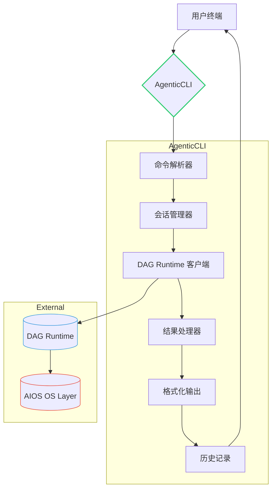
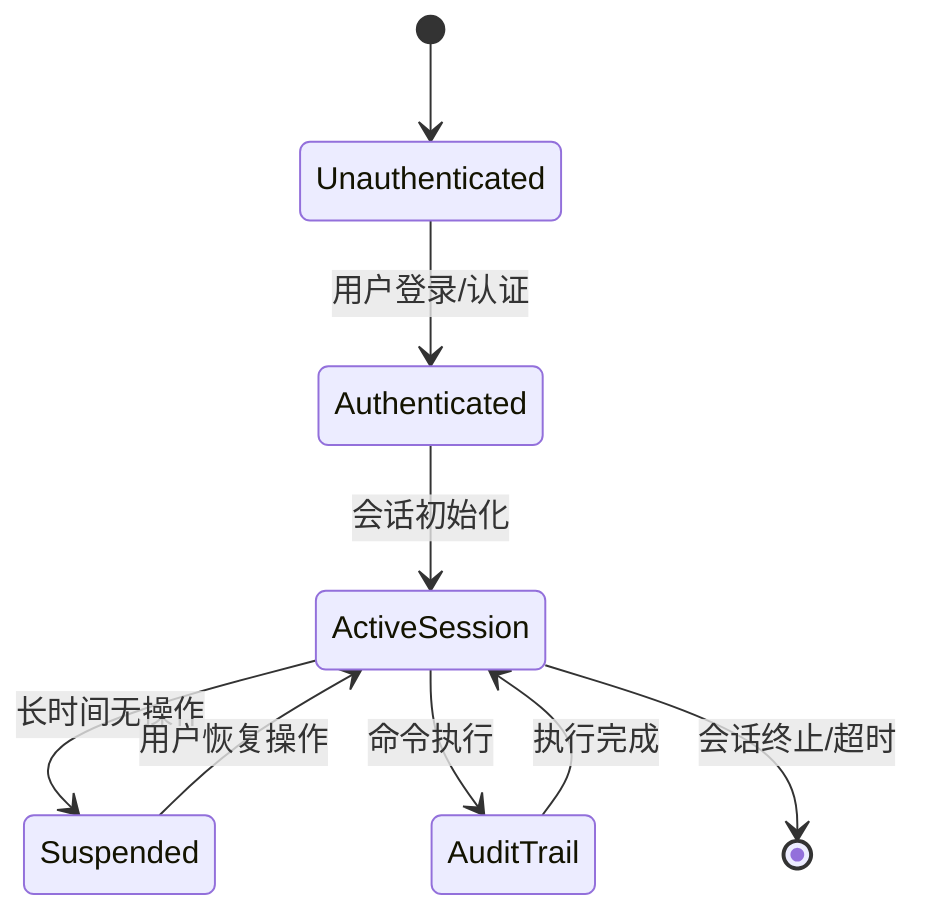
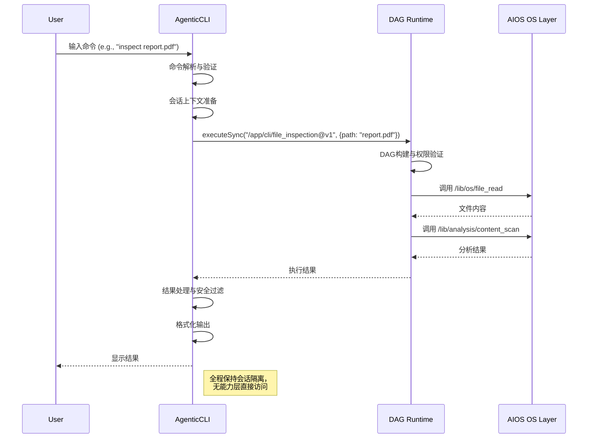

# AgenticCLI 架构设计文档 v2.0

> **版本**: 2.0  
> **日期**: 2025年11月24日  
> **作者**: Agentic架构专家组  
> **目标**: 定义专注于命令行交互的AgenticCLI架构，明确与AIOS能力层和DAG Runtime的边界

## 1. 核心定位与边界

### 1.1 精准定位
```
┌─────────────────────────────────────────────────────────────────────┐
│                       Agentic生态系统架构                           │
│                                                                     │
│  ┌──────────────┐    ┌──────────────┐    ┌───────────────────────┐  │
│  │   应用层     │    │   能力层     │    │     基础层            │  │
│  │  (Apps)     │    │(Capabilities)│    │  (Runtime/Platform)   │  │
│  └──────┬───────┘    └──────┬───────┘    └──────────┬────────────┘  │
│         │                  │                       │               │
│  ┌──────▼───────┐  ┌───────▼─────────┐  ┌──────────▼─────────────┐ │
│  │  /app/cli    │  │    AIOS OS     │  │       DAG Runtime      │ │
│  │ (CLI工作流)  │  │  (/lib/os/**)   │  │  (执行引擎)            │ │
│  └──────┬───────┘  └─────────────────┘  └──────────┬─────────────┘ │
│         │                                         │               │
│  ┌──────▼─────────────────────────────────────────▼─────────────┐ │
│  │                    AgenticCLI (交互层)                       │ │
│  │  • 命令解析  • 会话管理  • 结果呈现  • 用户反馈              │ │
│  └──────────────────────────────────────────────────────────────┘ │
│         ▲                                                         │
│         │                                                         │
│  ┌──────┴─────────────────────────────────────────────────────┐  │
│  │                      终端用户 (Human)                      │  │
│  └────────────────────────────────────────────────────────────┘  │
└───────────────────────────────────────────────────────────────────┘
```

### 1.2 关键职责声明
✅ **AgenticCLI是纯交互层**，不包含业务逻辑实现  
✅ **只负责命令解析、会话管理、结果呈现**  
✅ **通过DAG Runtime间接调用AIOS能力**  
✅ **维护用户会话状态，但不持久化业务数据**  

❌ **不直接调用`/lib/os/**`能力**  
❌ **不实现DAG调度/执行逻辑**  
❌ **不管理安全沙箱策略**  
❌ **不处理原子级OS操作**  

## 2. 架构概览

### 2.1 高层次组件图


### 2.2 核心组件职责
| 组件 | 职责 | 依赖 | 输出 |
|------|------|------|------|
| **命令解析器** | 将用户输入解析为结构化命令 | 命令模式注册表 | 结构化命令对象 |
| **会话管理器** | 管理会话状态、上下文、权限 | 用户认证服务 | 安全上下文 |
| **DAG客户端** | 与DAG Runtime通信，提交/查询执行 | 网络/IPC客户端 | 执行ID/结果 |
| **结果处理器** | 处理执行结果，错误转换 | 结果模式注册表 | 标准化结果 |
| **格式化输出** | 根据用户偏好格式化输出 | 配置管理器 | 终端/JSON/HTML |
| **历史记录** | 记录命令历史，支持审计 | 本地存储 | 历史数据 |

## 3. 详细组件设计

### 3.1 命令解析器 (CommandParser)

#### 3.1.1 多模态解析架构
```
┌─────────────────────────────────────────────────────────────────┐
│                      命令解析流水线                             │
│                                                                 │
│  ┌─────────────┐  ┌─────────────┐  ┌─────────────────────────┐  │
│  │ 原始输入     │  │ 预处理      │  │ 上下文感知解析          │  │
│  │ (用户输入)   │─▶│ • 历史替换  │─▶│ • 语法分析             │  │
│  └─────────────┘  │ • 变量展开  │  │ • 语义理解             │  │
│                    │ • 路径补全  │  │ • 模式匹配             │  │
│                    └─────────────┘  └──────────┬──────────────┘  │
│                                               │                 │
│  ┌───────────────────────────────────────────▼───────────────┐ │
│  │                命令标准化 (Command Normalization)         │ │
│  │  • 参数验证 • 默认值注入 • 类型转换 • 权限前置检查       │ │
│  └───────────────────────────────┬───────────────────────────┘ │
│                                  │                             │
│  ┌───────────────────────────────▼───────────────────────────┐ │
│  │                结构化命令对象 (StructuredCommand)        │ │
│  │  {                                                       │ │
│  │    name: "inspect",                                       │ │
│  │    target: "/home/user/file.txt",                         │ │
│  │    options: { format: "json", max_size: 1024 },          │ │
│  │    workflow: "/app/cli/file_inspection@v1"               │ │
│  │  }                                                       │ │
│  └───────────────────────────────────────────────────────────┘ │
└─────────────────────────────────────────────────────────────────┘
```

#### 3.1.2 关键实现
```python
class CommandParser:
    def __init__(self, command_registry, context_provider):
        self.registry = command_registry  # 注册的命令模式
        self.context = context_provider   # 会话上下文提供者
        
    def parse(self, raw_input: str, session_ctx: SessionContext) -> ParsedCommand:
        # 1. 预处理
        preprocessed = self.preprocessor.process(raw_input, session_ctx)
        
        # 2. 命令识别
        command_name, args_str = self.tokenize(preprocessed)
        
        # 3. 获取命令模式
        command_pattern = self.registry.get_pattern(command_name)
        if not command_pattern:
            raise CommandNotFoundError(command_name)
        
        # 4. 参数解析
        try:
            args = self.argument_parser.parse(args_str, command_pattern.schema)
        except ValidationError as e:
            raise InvalidArgumentsError(str(e))
        
        # 5. 上下文感知增强
        enhanced_args = self.context_enhancer.enhance(args, session_ctx, command_pattern)
        
        # 6. 权限前置检查
        if not self.permission_checker.has_permissions(
            session_ctx.user, 
            command_pattern.required_permissions
        ):
            raise PermissionDeniedError(command_pattern.required_permissions)
        
        # 7. 构造结构化命令
        return ParsedCommand(
            name=command_name,
            arguments=enhanced_args,
            workflow_path=command_pattern.workflow_path,
            execution_mode=command_pattern.default_mode,
            session_id=session_ctx.session_id
        )
```

### 3.2 会话管理器 (SessionManager)

#### 3.2.1 会话生命周期


#### 3.2.2 会话上下文结构
```python
class SessionContext:
    # 会话标识
    session_id: str
    user_identity: str
    
    # 安全上下文 (从DAG Runtime继承)
    effective_permissions: Set[str]
    sandbox_profile: str
    max_resource_budget: ResourceBudget
    
    # 会话状态
    current_directory: str
    environment_variables: Dict[str, str]
    command_history: List[HistoricalCommand]
    last_result: Optional[ExecutionResult]
    
    # 交互偏好
    output_format: str  # "text", "json", "table", "rich"
    verbosity_level: int
    timeout_seconds: int
    
    # 审计上下文
    audit_enabled: bool
    audit_level: str  # "minimal", "standard", "detailed"
```

### 3.3 DAG Runtime 客户端 (RuntimeClient)

#### 3.3.1 通信架构
```
┌─────────────────────────────────────────────────────────────────┐
│                     DAG Runtime 通信层                          │
│                                                                 │
│  ┌──────────────┐      ┌─────────────────┐      ┌──────────────┐ │
│  │ 同步模式      │      │ 异步模式        │      │ 流式模式     │ │
│  │ (简单命令)   │      │ (长时间操作)    │      │ (实时反馈)   │ │
│  └──────┬───────┘      └────────┬────────┘      └──────┬───────┘ │
│         │                       │                      │        │
│  ┌──────▼───────────────────────▼──────────────────────▼──────┐ │
│  │                  传输适配层 (Transport Layer)            │ │
│  │  • gRPC (生产) • HTTP/REST (兼容) • IPC (嵌入式)         │ │
│  └───────────────────────────────┬───────────────────────────┘ │
│                                  │                            │
│  ┌───────────────────────────────▼───────────────────────────┐ │
│  │                  协议转换层 (Protocol Layer)            │ │
│  │  • 请求序列化 • 响应反序列化 • 错误映射 • 重试策略       │ │
│  └───────────────────────────────────────────────────────────┘ │
└─────────────────────────────────────────────────────────────────┘
```

#### 3.3.2 关键接口
```typescript
interface RuntimeClient {
  /**
   * 执行工作流（同步模式）
   * 适用于快速完成的操作（<5秒）
   */
  executeSync(
    workflowPath: string,
    parameters: Record<string, any>,
    context: SessionContext,
    options?: {
      timeoutMs?: number;
      priority?: 'low' | 'normal' | 'high';
    }
  ): Promise<ExecutionResult>;
  
  /**
   * 启动异步执行
   * 适用于长时间运行的操作
   */
  executeAsync(
    workflowPath: string,
    parameters: Record<string, any>,
    context: SessionContext
  ): Promise<ExecutionHandle>;
  
  /**
   * 流式执行（实时反馈）
   * 适用于需要实时更新的操作
   */
  executeStream(
    workflowPath: string,
    parameters: Record<string, any>,
    context: SessionContext,
    callback: (event: StreamEvent) => void
  ): Promise<StreamHandle>;
  
  /**
   * 获取执行状态
   */
  getExecutionStatus(executionId: string): Promise<ExecutionStatus>;
  
  /**
   * 取消执行
   */
  cancelExecution(executionId: string): Promise<boolean>;
}
```

### 3.4 结果处理器 (ResultProcessor)

#### 3.4.1 结果转换流水线
```
┌─────────────────────────────────────────────────────────────────┐
│                      结果处理流水线                             │
│                                                                 │
│  ┌─────────────┐  ┌──────────────────┐  ┌─────────────────────┐  │
│  │ 原始结果     │  │ 标准化转换       │  │ 安全过滤            │  │
│  │ (DAG输出)   │─▶│ • 错误代码转换   │─▶│ • 敏感数据脱敏     │  │
│  └─────────────┘  │ • 数据类型统一   │  │ • 路径信息隐藏     │  │
│                    │ • 空值处理       │  │ • 许可证信息过滤   │  │
│                    └────────┬─────────┘  └──────────┬──────────┘  │
│                             │                       │            │
│  ┌──────────────────────────▼───────────────────────▼──────────┐ │
│  │                     上下文增强                             │ │
│  │  • 会话状态更新 • 历史记录添加 • 建议生成 • 错误恢复        │ │
│  └───────────────────────────────┬─────────────────────────────┘ │
│                                  │                              │
│  ┌───────────────────────────────▼────────────────────────────┐ │
│  │                   增强结果对象 (EnhancedResult)            │ │
│  │  {                                                       │ │
│  │    success: true,                                         │ │
│  │    data: { content: "...", size: 1234 },                  │ │
│  │    suggestions: ["Try 'summarize' for more details"],    │ │
│  │    execution_time: 234,                                   │ │
│  │    resource_usage: { cpu: 120, memory: 45 }               │ │
│  │  }                                                       │ │
│  └────────────────────────────────────────────────────────────┘ │
└──────────────────────────────────────────────────────────────────┘
```

#### 3.4.2 安全过滤策略
```python
class SecurityFilter:
    def __init__(self, session_context):
        self.context = session_context
        self.sensitive_patterns = [
            (r'password\s*[=:]\s*[^\s]+', '[REDACTED:password]'),
            (r'secret\s*[=:]\s*[^\s]+', '[REDACTED:secret]'),
            (r'api[_-]?key\s*[=:]\s*[^\s]+', '[REDACTED:api_key]'),
            (r'/etc/shadow', '/[SYSTEM_PATH_REDACTED]'),
            (r'/home/[^/]+/.ssh', '/[USER_SSH_PATH_REDACTED]')
        ]
    
    def filter_result(self, result: dict) -> dict:
        # 1. 深度遍历结果结构
        filtered = self._traverse_and_filter(result)
        
        # 2. 基于权限的敏感字段过滤
        if not self.context.has_permission("system:debug"):
            filtered = self._remove_sensitive_fields(filtered)
        
        # 3. 资源使用信息脱敏
        if "resource_usage" in filtered:
            filtered["resource_usage"] = self._sanitize_resource_usage(
                filtered["resource_usage"]
            )
        
        return filtered
    
    def _traverse_and_filter(self, obj):
        """递归过滤敏感数据"""
        if isinstance(obj, str):
            return self._filter_sensitive_string(obj)
        elif isinstance(obj, dict):
            return {k: self._traverse_and_filter(v) for k, v in obj.items()}
        elif isinstance(obj, list):
            return [self._traverse_and_filter(item) for item in obj]
        else:
            return obj
```

### 3.5 格式化输出 (OutputFormatter)

#### 3.5.1 多格式支持
| 格式 | 适用场景 | 特性 | 依赖 |
|------|---------|------|------|
| **文本/表格** | 终端交互 | 自适应宽度/颜色/进度条 | Rich, Tabulate |
| **JSON** | API/脚本 | 机器可读/结构化 | 标准JSON库 |
| **Markdown** | 文档生成 | 格式保留/链接/表格 | Markdown库 |
| **HTML** | Web集成 | 交互式/可视化 | 模板引擎 |
| **语音** | 无障碍 | TTS友好/简洁 | 语音合成API |

#### 3.5.2 智能格式选择
```python
class OutputFormatter:
    def __init__(self, config_provider):
        self.config = config_provider
    
    def format(self, result: EnhancedResult, context: SessionContext) -> FormattedOutput:
        # 1. 确定输出格式
        format_type = self._determine_format(context, result)
        
        # 2. 选择格式化器
        formatter = self._get_formatter(format_type)
        
        # 3. 应用格式
        output = formatter.format(result, context)
        
        # 4. 添加交互元素（如适用）
        if format_type == "text" and context.interactive_mode:
            output = self._add_interactive_elements(output, result)
        
        # 5. 应用样式规则
        return self._apply_styling(output, context.style_rules)
    
    def _determine_format(self, context, result):
        """基于上下文智能选择格式"""
        # 优先使用用户显式指定
        if context.explicit_format:
            return context.explicit_format
        
        # 基于结果类型
        if result.is_error:
            return "text"  # 错误通常需要文本解释
        
        if "visualization" in result.data or "chart" in result.data:
            return "rich"  # 可视化需要丰富格式
        
        # 基于终端能力
        if context.terminal_supports_colors:
            return "rich"
        
        # 默认
        return context.default_format
```

## 4. 关键流程设计

### 4.1 命令执行流程


### 4.2 会话管理流程
1. **会话初始化**
   - 用户认证
   - 权限评估
   - 沙箱配置加载
   - 会话ID生成

2. **会话维护**
   - 命令历史记录
   - 环境变量管理
   - 资源使用追踪
   - 超时监控

3. **会话终止**
   - 资源释放
   - 审计日志提交
   - 临时文件清理
   - 会话持久化（可选）

## 5. 安全与合规设计

### 5.1 安全原则
- **零信任交互**：每次命令执行都进行权限验证
- **最小权限**：会话上下文仅包含必要权限
- **数据脱敏**：输出自动过滤敏感信息
- **审计完整**：所有命令执行记录完整审计日志
- **故障隔离**：单个命令失败不影响会话稳定性

### 5.2 审计日志标准
```json
{
  "timestamp": "2025-11-24T13:28:45Z",
  "session_id": "sess_7a8b9c0d",
  "user_identity": "user@example.com",
  "command": {
    "raw_input": "inspect ~/financial_report.pdf",
    "parsed_command": "inspect",
    "arguments": {
      "path": "~/financial_report.pdf",
      "resolved_path": "/home/user/financial_report.pdf"
    }
  },
  "workflow_executed": "/app/cli/file_inspection@v1",
  "capabilities_invoked": [
    "/lib/os/file_read",
    "/lib/analysis/content_scan",
    "/lib/reporting/generate_summary"
  ],
  "result_summary": {
    "success": true,
    "execution_time_ms": 1245,
    "resource_usage": {
      "cpu_ms": 876,
      "memory_mb": 128,
      "io_bytes": 245760
    }
  },
  "security_context": {
    "effective_permissions": ["os:file_read", "analysis:content_scan"],
    "sandbox_profile": "user_standard",
    "data_sensitivity_level": "high"
  },
  "audit_trail_id": "audit_e1f2a3b4c5"
}
```

## 6. 部署与扩展

### 6.1 部署模式
| 模式 | 架构 | 适用场景 | 特性 |
|------|------|---------|------|
| **嵌入式** | 与DAG Runtime同进程 | 开发/测试环境 | 低延迟，简单配置 |
| **客户端-服务端** | 独立CLI客户端 + 远程Runtime | 多用户环境 | 集中管理，高安全 |
| **容器化** | Docker/Podman容器 | 云原生部署 | 隔离性，弹性扩展 |
| **Web终端** | WebAssembly + WebSocket | 浏览器访问 | 无安装，跨平台 |

### 6.2 插件扩展机制
```
┌─────────────────────────────────────────────────────────────────┐
│                      插件架构                                  │
│                                                                 │
│  ┌──────────────┐  ┌──────────────┐  ┌───────────────────────┐  │
│  │ 核心CLI      │  │ 命令插件      │  │ 输出格式插件          │  │
│  │ (Core)      │  │ (Commands)   │  │ (Output Formats)      │  │
│  └──────┬───────┘  └──────┬───────┘  └───────────┬───────────┘  │
│         │                 │                      │              │
│  ┌──────▼─────────────────▼──────────────────────▼───────────┐  │
│  │                    插件管理器 (Plugin Manager)           │  │
│  │  • 插件发现 • 依赖解析 • 版本控制 • 安全验证            │  │
│  └───────────────────────────────┬───────────────────────────┘  │
│                                  │                              │
│  ┌───────────────────────────────▼────────────────────────────┐ │
│  │                    插件注册表 (Plugin Registry)           │ │
│  │  /plugins/commands/git@v1                                   │ │
│  │  /plugins/commands/cloud@v2                                 │ │
│  │  /plugins/formats/jira_markdown@v1                          │ │
│  └─────────────────────────────────────────────────────────────┘ │
└───────────────────────────────────────────────────────────────────┘
```

### 6.3 配置管理
```yaml
# agentic-cli-config.yaml
version: "2.0"
default_format: "rich"
timeout_seconds: 30
history_size: 1000
audit:
  enabled: true
  level: "standard"
  retention_days: 90
plugins:
  enabled:
    - "git_commands@v1"
    - "cloud_storage@v2"
    - "jira_formatter@v1"
security:
  sensitive_data_filtering: true
  path_obfuscation: true
  max_output_size_kb: 1024
appearance:
  theme: "dark"
  syntax_highlighting: true
  progress_indicators: true
runtime_connection:
  type: "grpc"
  endpoint: "localhost:50051"
  timeout_ms: 5000
  retry_policy:
    max_attempts: 3
    backoff_multiplier: 2.0
```

## 7. 演进路线

### 7.1 版本路线图
| 版本 | 重点 | 关键特性 |
|------|------|----------|
| **v1.0 (MVP)** | 核心交互 | 命令解析、基础会话、DAG集成 |
| **v1.5** | 用户体验 | 智能补全、上下文感知、历史学习 |
| **v2.0 (当前)** | 安全合规 | 审计追踪、数据脱敏、权限隔离 |
| **v2.5** | 协作能力 | 多用户会话、命令共享、协作工作流 |
| **v3.0** | 智能交互 | 语音输入/输出、预测命令、自适应UI |

### 7.2 未来方向
- **自然语言理解**：直接理解非结构化命令
- **预测性交互**：基于历史预测用户下一步操作
- **跨会话学习**：在隐私保护前提下学习用户偏好
- **无障碍优先**：全面支持屏幕阅读器、语音控制
- **零配置体验**：自动适应环境，无需手动配置

## 8. 附录：关键接口定义

### 8.1 AgenticCLI 主接口
```typescript
interface AgenticCLI {
  start(sessionOptions?: SessionOptions): Promise<void>;
  executeCommand(rawInput: string): Promise<FormattedOutput>;
  registerCommandPattern(pattern: CommandPattern): void;
  registerOutputFormatter(formatter: OutputFormatter): void;
  getSessionContext(): SessionContext;
  closeSession(): Promise<void>;
}
```

### 8.2 命令模式定义
```typescript
interface CommandPattern {
  name: string;                  // 命令名称 (e.g., "inspect")
  aliases?: string[];           // 别名 (e.g., ["view", "show"])
  description: string;          // 命令描述
  workflow_path: string;        // 对应工作流路径
  required_permissions: string[]; // 所需权限
  arguments_schema: JSONSchema; // 参数JSON Schema
  examples: string[];           // 使用示例
  default_mode: "sync" | "async" | "stream";
}
```

## 专家总结

AgenticCLI作为**纯交互层**，通过清晰的职责分离实现了：
1. **安全边界**：绝不直接访问AIOS能力，所有操作通过DAG Runtime
2. **用户体验**：提供智能、响应式的命令行体验
3. **可审计性**：完整记录所有用户交互，满足合规要求
4. **可扩展性**：通过插件机制支持定制化扩展
5. **一致性**：跨平台提供统一的交互体验

**核心口诀**：  
*解析而不执行，呈现而不存储，  
路由而不实现，记录而不修改。*  

此架构确保AgenticCLI保持轻量、专注，成为连接人类用户与强大AIOS能力的安全桥梁。
