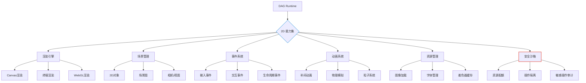

# AIOS 2D能力扩展架构设计文档 v1.0

> **版本**: 1.0  
> **日期**: 2025年11月24日  
> **作者**: AIOS核心架构团队  
> **目标**: 定义AIOS中2D UI能力扩展部分的架构，作为能力层的关键组件

## 1. 核心定位与边界

### 1.1 能力层定位
```
┌─────────────────────────────────────────────────────────────────────┐
│                          AIOS 能力架构                              │
│                                                                     │
│  ┌───────────────────────────────────────────────────────────────┐  │
│  │                       能力层 (Capabilities)                   │  │
│  │                                                               │  │
│  │  ┌─────────────┐  ┌─────────────┐  ┌───────────────────────┐  │  │
│  │  │  /lib/os/   │  │  /lib/net/  │  │    /lib/ui/2d/        │  │  │
│  │  │ (文件/进程) │  │  (网络)     │  │  (2D渲染能力)         │  │  │
│  │  └──────┬──────┘  └──────┬──────┘  └───────────┬─────────────┘  │  │
│  │         │               │                     │                │  │
│  └─────────┼───────────────┼─────────────────────┼────────────────┘  │
│            │               │                     │                   │
│  ┌─────────▼───────────────▼─────────────────────▼───────────────┐  │
│  │                     DAG Runtime (执行层)                      │  │
│  │  • 能力调度 • 资源管理 • 安全沙箱 • 错误处理                 │  │
│  └───────────────────────────────┬───────────────────────────────┘  │
│                                  │                                 │
│  ┌───────────────────────────────▼───────────────────────────────┐  │
│  │                    应用层 (Applications)                      │  │
│  │  • AgenticCLI • Web界面 • 移动应用 • 桌面应用                │  │
│  └───────────────────────────────────────────────────────────────┘  │
└─────────────────────────────────────────────────────────────────────┘
```

### 1.2 关键原则与边界
✅ **/lib/ui/2d/** 是纯能力层，提供原子化2D UI操作  
✅ **无状态设计**，不维护用户会话或业务上下文  
✅ **通过DAG Runtime间接暴露**给应用层，不直接暴露API  
✅ **资源隔离**，每个2D操作有明确的资源预算  

❌ **不包含业务逻辑**（如"创建仪表盘"）  
❌ **不处理用户认证/授权**（由DAG Runtime负责）  
❌ **不直接与用户交互**（由应用层处理）  
❌ **不管理持久化状态**（如用户偏好、布局配置）  

## 2. 架构概览

### 2.1 高层次组件图


### 2.2 能力分类
| 类别 | 能力路径 | 描述 | 安全级别 |
|------|----------|------|----------|
| **基础渲染** | `/lib/ui/2d/render/**` | 2D图形渲染核心能力 | 中 |
| **场景管理** | `/lib/ui/2d/scene/**` | 场景与对象管理 | 低 |
| **用户交互** | `/lib/ui/2d/interaction/**` | 事件处理与响应 | 中 |
| **动画效果** | `/lib/ui/2d/animation/**` | 动画效果实现 | 低 |
| **资源处理** | `/lib/ui/2d/resources/**` | 媒体资源加载与管理 | 高 |
| **可视化** | `/lib/ui/2d/viz/**` | 数据可视化组件 | 中 |
| **辅助功能** | `/lib/ui/2d/accessibility/**` | 无障碍支持 | 低 |

## 3. 详细能力设计

### 3.1 基础渲染能力 (`/lib/ui/2d/render/**`)

#### 3.1.1 渲染上下文管理
```agenticdsl
### AgenticDSL Capability '/lib/ui/2d/render/context@v1'
name: "2d_render_context"
description: "创建和管理2D渲染上下文"
parameters:
  width: 
    type: integer
    min: 100
    max: 4096
    default: 800
  height:
    type: integer
    min: 100
    max: 4096
    default: 600
  backend:
    type: string
    enum: ["canvas", "terminal", "webgl", "svg"]
    default: "canvas"
  quality:
    type: string
    enum: ["low", "medium", "high"]
    default: "medium"

returns:
  context_id: string
  supported_features: array<string>
  max_texture_size: integer

permissions:
  - ui:render:create_context

resource_budget:
  max_memory_mb: 64
  max_gpu_memory_mb: 128
  max_cpu_ms_per_frame: 5

sandbox_policy:
  max_contexts_per_session: 3
  max_lifetime_seconds: 3600
  network_access: false
```

#### 3.1.2 基础图形绘制
```agenticdsl
### AgenticDSL Capability '/lib/ui/2d/render/primitives@v1'
name: "draw_primitives"
description: "绘制2D基础图形（线条、矩形、圆形等）"
parameters:
  context_id: string  # 由context@v1创建
  primitives: array<primitive_object>
    # primitive_object 结构:
    # {
    #   type: "line"|"rect"|"circle"|"path",
    #   points: array<{x: float, y: float}>,
    #   style: {
    #     stroke_color: string,
    #     fill_color: string,
    #     line_width: float,
    #     opacity: float
    #   }
    # }

returns:
  drawn_count: integer
  bounds: {x: float, y: float, width: float, height: float}

permissions:
  - ui:render:draw
  - ui:render:access_context:${context_id}

resource_budget:
  max_cpu_ms: 10
  max_gpu_commands: 1000

sandbox_policy:
  max_primitives_per_call: 1000
  max_points_per_primitive: 100
```

### 3.2 场景管理能力 (`/lib/ui/2d/scene/**`)

#### 3.2.1 场景图管理
```agenticdsl
### AgenticDSL Capability '/lib/ui/2d/scene/graph@v1'
name: "scene_graph"
description: "创建和管理2D场景图结构"
parameters:
  context_id: string
  operations: array<operation>
    # operation 结构:
    # {
    #   type: "create"|"update"|"delete"|"reparent",
    #   node_id: string?,
    #   parent_id: string?,
    #   properties: {
    #     transform: {x: float, y: float, rotation: float, scale: float},
    #     visibility: boolean,
    #     custom_data: any
    #   }
    # }

returns:
  scene_version: integer
  affected_nodes: array<string>
  scene_bounds: {x: float, y: float, width: float, height: float}

permissions:
  - ui:scene:manage
  - ui:render:access_context:${context_id}

resource_budget:
  max_cpu_ms: 20
  max_memory_mb: 16

sandbox_policy:
  max_nodes_per_scene: 10000
  max_depth: 20
  max_operations_per_call: 100
```

#### 3.2.2 相机/视图控制
```agenticdsl
### AgenticDSL Capability '/lib/ui/2d/scene/camera@v1'
name: "scene_camera"
description: "控制2D场景的相机/视图变换"
parameters:
  context_id: string
  camera_id: string
  transform:
    position: {x: float, y: float}
    zoom: float  # 0.1 - 10.0
    rotation: float  # 弧度
  viewport:
    x: float
    y: float
    width: float
    height: float

returns:
  view_matrix: array<float[16]>
  visible_bounds: {x: float, y: float, width: float, height: float}
  visible_node_count: integer

permissions:
  - ui:scene:camera
  - ui:render:access_context:${context_id}

resource_budget:
  max_cpu_ms: 5
  max_gpu_commands: 10

sandbox_policy:
  max_cameras_per_context: 5
  zoom_limits: {min: 0.1, max: 10.0}
```

### 3.3 交互能力 (`/lib/ui/2d/interaction/**`)

#### 3.3.1 事件监听
```agenticdsl
### AgenticDSL Capability '/lib/ui/2d/interaction/events@v1'
name: "event_listener"
description: "注册2D场景的交互事件监听器"
parameters:
  context_id: string
  event_types: array<string>  # ["click", "hover", "drag", "wheel", "key"]
  target_nodes: array<string>?  # 指定节点ID，null表示全部
  options:
    capture_phase: boolean
    passive: boolean
    prevent_default: boolean

returns:
  listener_id: string
  supported_events: array<string>

permissions:
  - ui:interaction:listen
  - ui:render:access_context:${context_id}

resource_budget:
  max_cpu_ms: 2
  max_memory_mb: 4

sandbox_policy:
  max_listeners_per_context: 50
  event_rate_limit: 100  # 每秒最大事件数
  sensitive_events_requires_explicit_permission: true
```

#### 3.3.2 事件处理
```agenticdsl
### AgenticDSL Capability '/lib/ui/2d/interaction/handle_event@v1'
name: "handle_event"
description: "处理已捕获的交互事件"
parameters:
  context_id: string
  listener_id: string
  event_data: event_object
    # event_object 结构:
    # {
    #   type: string,
    #   timestamp: integer,
    #   target_node_id: string?,
    #   position: {x: float, y: float},
    #   details: any  # 事件特定数据
    # }

returns:
  handled: boolean
  updated_nodes: array<string>
  new_state: any?

permissions:
  - ui:interaction:handle
  - ui:render:access_context:${context_id}

resource_budget:
  max_cpu_ms: 5
  max_memory_mb: 8

sandbox_policy:
  max_handling_time_ms: 50
  prevent_infinite_loop: true
  event_data_size_limit_kb: 64
```

### 3.4 资源管理能力 (`/lib/ui/2d/resources/**`)

#### 3.4.1 图像加载
```agenticdsl
### AgenticDSL Capability '/lib/ui/2d/resources/image_load@v1'
name: "image_load"
description: "安全加载2D图像资源"
parameters:
  source:
    type: string  # "path", "url", "data_uri", "system_icon"
    value: string
  options:
    max_width: integer?
    max_height: integer?
    format: string?  # "png", "jpeg", "webp"
    cache_policy: string  # "memory", "disk", "none"

returns:
  image_id: string
  dimensions: {width: integer, height: integer}
  format: string
  size_bytes: integer
  cached: boolean

permissions:
  - ui:resources:image_load
  - file:read:${source.value} if source.type == "path"
  - network:fetch if source.type == "url"

resource_budget:
  max_cpu_ms: 100
  max_memory_mb: 64
  max_network_kb: 1024

sandbox_policy:
  source_validation:
    path: ["^/assets/", "^/user_data/"]
    url: ["^https://trusted-cdn.example.com/"]
  max_image_size_mb: 2
  content_scanning: true
  cache_limit_mb: 32
```

#### 3.4.2 字体管理
```agenticdsl
### AgenticDSL Capability '/lib/ui/2d/resources/fonts@v1'
name: "font_management"
description: "管理2D渲染使用的字体资源"
parameters:
  operation: string  # "load", "list", "unload"
  font_spec: font_specification?
    # font_specification 结构:
    # {
    #   family: string,
    #   weight: string?  # "normal", "bold", etc.
    #   style: string?   # "normal", "italic"
    #   source: string?  # "system", "path", "url"
    #   path: string?
    # }

returns:
  operation_result: any
  available_fonts: array<font_info>?  # operation == "list" 时返回

permissions:
  - ui:resources:fonts
  - file:read:${font_spec.path} if font_spec.source == "path"

resource_budget:
  max_cpu_ms: 50
  max_memory_mb: 16

sandbox_policy:
  allowed_font_families: ["system", "monospace", "sans-serif", "serif"]
  max_custom_fonts: 5
  system_font_access_limited: true
```

### 3.5 动画能力 (`/lib/ui/2d/animation/**`)

#### 3.5.1 补间动画
```agenticdsl
### AgenticDSL Capability '/lib/ui/2d/animation/tween@v1'
name: "tween_animation"
description: "创建和管理2D补间动画"
parameters:
  context_id: string
  animation_spec:
    target_nodes: array<string>
    duration_ms: integer  # 10 - 5000
    easing: string  # "linear", "ease-in", "ease-out", "ease-in-out", "spring"
    properties: array<property_animation>
      # property_animation 结构:
      # {
      #   property: string,  # "position.x", "scale", "opacity", etc.
      #   from: any,
      #   to: any,
      #   delay_ms: integer?
      # }
    loop: boolean?
    repeat_count: integer?

returns:
  animation_id: string
  estimated_frames: integer
  max_resource_usage: {cpu_ms: float, gpu_commands: integer}

permissions:
  - ui:animation:create
  - ui:render:access_context:${context_id}

resource_budget:
  max_cpu_ms: 30
  max_gpu_commands: 500
  max_duration_ms: 5000  # 单次动画最大持续时间

sandbox_policy:
  max_concurrent_animations: 10
  max_nodes_per_animation: 100
  prevent_infinite_loop: true
  easing_function_restrictions: ["no_custom_functions"]
```

## 4. 安全与资源管理

### 4.1 安全边界设计
```
┌─────────────────────────────────────────────────────────────────────┐
│                      AIOS 2D 安全架构                              │
│                                                                     │
│  ┌───────────────────────────────────────────────────────────────┐  │
│  │                      能力调用 (Untrusted)                     │  │
│  │  • 应用层 • DAG Runtime • 用户命令                           │  │
│  └───────────────────────────┬───────────────────────────────────┘  │
│                              │                                      │
│  ┌───────────────────────────▼───────────────────────────────────┐  │
│  │                   安全代理层 (Security Proxy)                 │  │
│  │  • 参数验证 • 权限检查 • 资源预算验证 • 敏感操作审计         │  │
│  └───────────────────────────┬───────────────────────────────────┘  │
│                              │                                      │
│  ┌───────────────────────────▼───────────────────────────────────┐  │
│  │                    沙箱执行环境 (Sandbox)                     │  │
│  │  • 资源隔离 • 操作限制 • 时间限制 • 内存限制                │  │
│  └───────────────────────────┬───────────────────────────────────┘  │
│                              │                                      │
│  ┌───────────────────────────▼───────────────────────────────────┐  │
│  │                   原子能力实现 (Trusted)                     │  │
│  │  • 渲染引擎 • 资源加载 • 事件处理 • 无外部依赖              │  │
│  └───────────────────────────────────────────────────────────────┘  │
└─────────────────────────────────────────────────────────────────────┘
```

### 4.2 关键安全策略

#### 4.2.1 资源配额管理
| 资源类型 | 默认配额 | 最大配额 | 重置策略 |
|----------|----------|----------|----------|
| **内存** | 64MB | 256MB | 会话结束 |
| **GPU内存** | 128MB | 512MB | 会话结束 |
| **CPU时间** | 100ms/帧 | 500ms/帧 | 每帧重置 |
| **网络带宽** | 1MB/会话 | 10MB/会话 | 会话结束 |
| **文件访问** | 仅白名单路径 | 10个文件 | 会话结束 |
| **渲染对象** | 1000个 | 10000个 | 按上下文 |

#### 4.2.2 敏感操作审计级别
```python
SENSITIVE_OPERATIONS = {
    # 高风险操作 - 需要显式权限 + 审计
    "network_access": {
        "permission": "ui:resources:network",
        "audit_level": "detailed",
        "requires_user_consent": True
    },
    "file_system_access": {
        "permission": "ui:resources:filesystem",
        "audit_level": "detailed",
        "path_restrictions": ["/assets/", "/user_data/"]
    },
    # 中风险操作 - 需要权限
    "user_input_capture": {
        "permission": "ui:interaction:input_capture",
        "audit_level": "standard",
        "data_masking": True
    },
    # 低风险操作 - 基础权限
    "render_operations": {
        "permission": "ui:render:basic",
        "audit_level": "minimal"
    }
}
```

#### 4.2.3 沙箱隔离策略
- **进程隔离**：2D渲染在独立进程中执行，使用IPC通信
- **内存隔离**：使用WebAssembly内存沙箱，防止内存越界
- **时间隔离**：单帧渲染超时16ms自动终止（60FPS目标）
- **资源隔离**：每个渲染上下文有独立资源池，防止相互影响
- **网络隔离**：默认禁止网络访问，需要显式授权

## 5. 跨平台支持设计

### 5.1 渲染后端抽象
```
┌─────────────────────────────────────────────────────────────────────┐
│                      渲染后端抽象层                                │
│                                                                     │
│  ┌───────────────────────────────────────────────────────────────┐  │
│  │                 2D能力API (统一接口)                          │  │
│  │  • draw_rectangle() • load_image() • create_animation()     │  │
│  └───────────────────────────┬───────────────────────────────────┘  │
│                              │                                      │
│  ┌───────────────────────────▼───────────────────────────────────┐  │
│  │                  后端适配器 (Backend Adapters)                │  │
│  │  • CanvasAdapter • TerminalAdapter • WebGLAdapter           │  │
│  └───────────────────────────┬───────────────────────────────────┘  │
│                              │                                      │
│  ┌───────────────┬───────────┼────────────┬───────────────────────┐  │
│  │  Web环境     │  终端环境  │  桌面环境   │  服务器环境          │  │
│  │ (浏览器)     │ (CLI/TUI)  │ (Electron) │ (无头渲染)          │  │
│  └───────────────┴───────────┴────────────┴───────────────────────┘  │
└─────────────────────────────────────────────────────────────────────┘
```

### 5.2 环境自适应策略
| 环境特性 | 适应策略 | 能力调整 |
|----------|----------|----------|
| **Web浏览器** | 使用Canvas/WebGL | 禁用文件系统访问，限制网络 |
| **终端环境** | ANSI/Unicode渲染 | 降低图像质量，简化动画 |
| **移动设备** | 触摸优先API | 降低资源配额，优化电池使用 |
| **服务器环境** | 无头渲染 | 禁用交互，仅支持离线渲染 |
| **低性能设备** | 降级渲染 | 简化效果，降低帧率 |

## 6. 部署与集成

### 6.1 部署拓扑
```
┌─────────────────────────────────────────────────────────────────────┐
│                         AIOS 2D 部署架构                           │
│                                                                     │
│  ┌───────────────┐    ┌─────────────────────────────────────────┐  │
│  │   应用层      │    │             AIOS 核心                 │  │
│  │ (AgenticCLI)  │    │                                         │  │
│  └───────┬───────┘    │  ┌─────────────┐    ┌─────────────────┐  │  │
│          │            │  │ DAG Runtime │    │ 2D能力服务      │  │  │
│  ┌───────▼───────┐    │  │ (调度/安全) │◄──►│ (微服务架构)   │  │  │
│  │  用户终端     │    │  └──────┬──────┘    └────────┬────────┘  │  │
│  │ (浏览器/终端) │    │         │                    │           │  │
│  └───────────────┘    │  ┌──────▼────────────────────▼───────┐  │  │
│                       │  │        资源服务层             │  │  │
│                       │  │  • 图像缓存 • 字体服务 • 着色器库 │  │  │
│                       │  └─────────────────────────────────┘  │  │
│                       └───────────────────────────────────────┘  │
└───────────────────────────────────────────────────────────────────┘
```

### 6.2 服务模式
| 部署模式 | 适用场景 | 特性 | 资源需求 |
|----------|----------|------|----------|
| **嵌入式** | CLI工具 | 低延迟，单进程 | CPU: 1核, RAM: 256MB |
| **本地服务** | 桌面应用 | 平衡性能/隔离 | CPU: 2核, RAM: 512MB |
| **远程服务** | Web应用 | 集中管理，高安全 | CPU: 4核, RAM: 2GB + GPU |
| **混合模式** | 企业环境 | 关键操作本地，复杂渲染远程 | 按需分配 |

## 7. 性能优化策略

### 7.1 渲染管线优化
```
┌─────────────────────────────────────────────────────────────────────┐
│                      2D 渲染管线优化                              │
│                                                                     │
│  ┌─────────────┐  ┌─────────────┐  ┌─────────────────────────────┐  │
│  │  场景准备    │  │  批处理优化  │  │  GPU指令生成            │  │
│  │ (CPU)       │─▶│ (CPU)       │─▶│ (GPU驱动)               │  │
│  └──────┬──────┘  └──────┬──────┘  └───────────────┬─────────────┘  │
│         │               │                         │                │
│  ┌──────▼───────────────▼─────────────────────────▼─────────────┐  │
│  │                 异步资源加载                                │  │
│  │  • 纹理流式加载 • 字体预取 • 着色器编译                     │  │
│  └─────────────────────────────────────────────────────────────┘  │
│         │                                                         │
│  ┌──────▼─────────────────────────────────────────────────────┐  │
│  │                 帧缓冲管理                                 │  │
│  │  • 双缓冲/三缓冲 • 部分更新 • 脏区域追踪                   │  │
│  └─────────────────────────────────────────────────────────────┘  │
└─────────────────────────────────────────────────────────────────────┘
```

### 7.2 关键性能指标 (KPIs)
| 指标 | 目标 | 测量方式 | 优化策略 |
|------|------|----------|----------|
| **帧率** | 60 FPS | 每帧渲染时间 | 批处理、LOD、剔除 |
| **首帧时间** | < 100ms | 从调用到首帧 | 预热、缓存、懒加载 |
| **内存占用** | < 128MB | 峰值内存使用 | 对象池、引用计数 |
| **CPU使用率** | < 30% | 每帧CPU时间 | 多线程、算法优化 |
| **能耗** | 低 | 电池消耗率 | 降低更新频率、简化效果 |

## 8. 演进路线

### 8.1 版本路线图
| 版本 | 重点 | 关键能力 |
|------|------|----------|
| **v1.0 (当前)** | 核心2D能力 | 基础渲染、场景管理、事件处理 |
| **v1.5** | 性能优化 | 批处理渲染、资源缓存、LOD支持 |
| **v2.0** | 3D集成 | 2.5D效果、简单3D对象、混合渲染 |
| **v2.5** | 高级效果 | 粒子系统、物理模拟、后处理效果 |
| **v3.0** | 智能UI | 布局自适应、语义化交互、AR集成 |

### 8.2 与AIOS整合路线
1. **阶段1**：独立2D能力，通过DAG Runtime集成
2. **阶段2**：与`/lib/os/**`深度集成，支持截图、屏幕分析等
3. **阶段3**：与AI能力集成，支持智能布局、内容生成
4. **阶段4**：跨设备协同，多屏2D内容无缝流转

## 9. 附录：关键接口定义

### 9.1 2D能力标准接口
```typescript
interface D2Capability {
  /**
   * 能力元数据
   */
  metadata: {
    name: string;
    version: string;
    description: string;
    parameters_schema: JSONSchema;
    returns_schema: JSONSchema;
    permissions: string[];
    resource_budget: ResourceBudget;
    sandbox_policy: SandboxPolicy;
  };
  
  /**
   * 执行能力
   * @param params 结构化参数
   * @param context 执行上下文（由DAG Runtime提供）
   * @returns 执行结果
   */
  execute(params: Record<string, any>, context: ExecutionContext): Promise<ExecutionResult>;
  
  /**
   * 验证参数
   * @param params 输入参数
   * @returns 验证结果
   */
  validate(params: Record<string, any>): ValidationResult;
  
  /**
   * 估算资源使用
   * @param params 输入参数
   * @returns 资源使用估算
   */
  estimateResources(params: Record<string, any>): ResourceEstimation;
}
```

### 9.2 资源预算定义
```typescript
interface ResourceBudget {
  // CPU资源 (毫秒)
  max_cpu_ms?: number;
  max_cpu_ms_per_frame?: number;
  
  // 内存资源 (MB)
  max_memory_mb?: number;
  max_gpu_memory_mb?: number;
  
  // 网络资源 (KB)
  max_network_kb?: number;
  
  // GPU资源
  max_gpu_commands?: number;
  max_texture_size?: number;
  
  // 操作限制
  max_operations?: number;
  max_duration_ms?: number;
}
```

## 专家总结

AIOS的2D能力扩展架构设计遵循**原子化、安全优先、资源可控**的核心原则：

1. **能力原子化**：提供细粒度的2D UI操作能力，而非高级业务逻辑
2. **安全沙箱**：通过代理层、资源配额、操作审计实现深度防御
3. **资源可控**：精确的资源预算管理，确保系统稳定性
4. **环境自适应**：同一套能力接口，适应Web、终端、桌面等多种环境
5. **性能优先**：渲染管线优化、异步加载、批处理等策略保障流畅体验

**核心口诀**：  
*原子能力无状态，安全沙箱保边界，  
资源预算精控制，环境自适应无缝。*  

此架构为AIOS提供了强大的2D UI能力基础，同时保持了与系统其他部分的清晰边界，为未来扩展（如3D、AR、智能UI）奠定了坚实基础。
