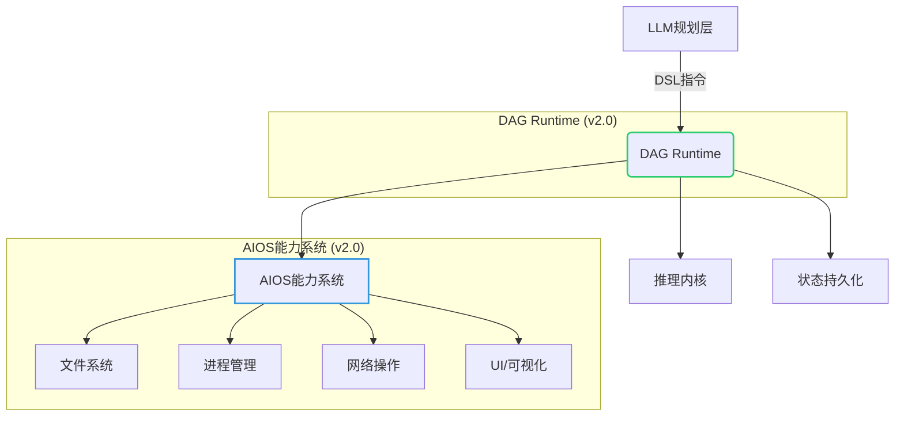
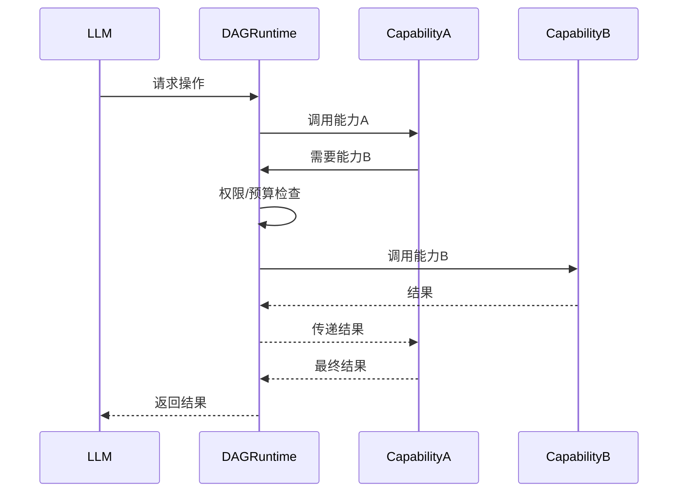

# AIOS & DAG Runtime 规范 v2.0

> 专家组联合起草 · 2025年11月24日  
> **目标**: 定义统一、安全、可扩展的Agentic应用运行时规范，实现DAG执行引擎与AIOS能力系统的深度融合

## 1. 概述

### 1.1 愿景与目标
**核心愿景**：构建"LLM安全操作系统"，让智能体在严格隔离的环境中安全操作数字世界。

**关键目标**：
- ✅ **可信执行**：所有操作经过严格权限验证与沙箱隔离
- ✅ **能力抽象**：统一`/lib/**`能力接口，屏蔽底层平台差异
- ✅ **资源可控**：精细化预算管理，防止单点失败导致系统崩溃
- ✅ **审计完整**：全链路执行追踪，满足企业合规要求
- ✅ **无缝扩展**：支持动态加载可信能力，无需重启系统

### 1.2 架构全景


### 1.3 核心原则
- **沙箱优先**：任何能力执行前必须通过安全上下文验证
- **能力最小化**：每个工具函数仅暴露必要的功能边界
- **无隐式状态**：所有交互必须显式声明依赖与权限
- **审计完整性**：操作审计日志不可修改且包含完整执行上下文
- **故障隔离**：单点失败不应影响整体系统可用性

## 2. DAG Runtime 规范

### 2.1 执行引擎核心

#### 2.1.1 三层架构隔离
```
+---------------------+
|   Planning Layer    | ← LLM生成DSL、策略调整
+----------+----------+
           |
           v
+---------------------+
|  Orchestration Layer| ← DAG调度、预算管理、错误处理
+----------+----------+
           |
           v
+---------------------+
|  Execution Layer    | ← 能力执行、沙箱隔离、资源监控
+---------------------+
```

**关键隔离策略**：
- **物理隔离**：三层之间仅通过标准化接口通信，无共享内存
- **权限隔离**：
  - 规划层：仅可读取`/memory/**`和生成DSL
  - 编排层：可管理DAG结构，但不能直接调用操作系统
  - 执行层：在沙箱中执行能力，无权修改DAG结构
- **数据隔离**：每层有独立数据视图，高层不能绕过中间层访问底层

#### 2.1.2 DSL语法与语义
**核心结构**：
```agenticdsl
### AgenticDSL '/path/to/node@v1'
entry_point: true  # 是否为入口节点
signature:
  inputs: [...]    # 严格类型定义
  outputs: [...]   # 严格类型定义

type: [assign|tool_call|llm_call|generate_dsl|assert|fork_join]
# 具体配置...

permissions:
  - capability:permission  # 例: os:file_read

resource_allocation:
  max_cpu_ms: 100
  max_memory_mb: 50
  max_gpu_ms: 0  # 新增GPU资源维度

security:
  timeout_ms: 5000
  sandbox_profile: "user_standard"
```

**新增v2.0语义**：
- `gpu_resources`：声明GPU计算需求
- `accessibility_requirements`：强制无障碍标准
- `content_sensitivity`：数据敏感度标记
- `execution_environment`：指定执行环境要求（如WASM/原生）

### 2.2 调度与执行

#### 2.2.1 拓扑调度器
**执行阶段**：
1. **解析与验证**：验证DSL语法、签名、权限
2. **依赖分析**：构建DAG，检测循环依赖
3. **预算分配**：预分配资源预算
4. **执行**：按拓扑顺序执行节点
5. **结果聚合**：合并执行结果，处理错误

**关键约束**：
- 禁止动态修改已注册的`/lib/**`节点
- `/app/**`路径自动重写为`/main/**`保持兼容
- 超预算立即终止，跳转至`/__system__/budget_exceeded`

#### 2.2.2 上下文引擎
**上下文合并策略**：
| 策略 | 数组行为 | 对象行为 | 冲突处理 |
|------|---------|---------|---------|
| `array_concat` | 拼接 | 深度合并 | 无 |
| `deep_merge` | **完全替换** | 深度合并 | 无 |
| `last_write_wins` | 完全替换 | 完全替换 | 无 |
| `error_on_conflict` | 报错 | 报错 | 抛出异常 |

**TTL机制**：
```json
{
  "memory": {
    "temporary": {
      "value": "expires soon",
      "ttl_seconds": 30  // 30秒后自动删除
    }
  }
}
```

### 2.3 资源与预算管理

#### 2.3.1 资源维度
| 资源类型 | 计量单位 | 说明 |
|---------|---------|------|
| CPU | ms | 1ms = 1毫秒CPU时间 |
| 内存 | MB | 峰值内存占用 |
| GPU | ms | GPU计算时间 |
| IO | bytes | 读写字节数 |
| 网络 | bytes | 传输字节数 |
| 调用次数 | count | 子图调用次数 |

#### 2.3.2 预算控制器
```c++
class BudgetController {
public:
  bool check_and_consume(const ResourceBudget& request);
  void refund(const ResourceBudget& resources);
  
  struct ResourceBudget {
    int64_t cpu_ms = 0;
    int64_t memory_mb = 0;
    int64_t gpu_ms = 0;    // 新增
    int64_t io_bytes = 0;
    int64_t network_bytes = 0;
    int64_t subgraph_calls = 0;
  };
  
  // 嵌套预算：子图继承父图预算，但有独立配额
  std::shared_ptr<BudgetController> create_sub_budget();
};
```

### 2.4 C++推理内核集成

#### 2.4.1 推理能力接口
```c
// 核心推理内核C API
struct InferenceCore {
  void* (*tokenize)(const char* text);
  void* (*kv_alloc)(size_t cache_size);
  void (*kv_free)(void* kv);
  const char* (*model_step)(void* kv, const char* prompt);
  const char* (*compile_grammar)(const char* json_schema); // 结构化输出
  const char* (*stream_until)(void* kv, const char* stop_condition);
  float (*get_resource_usage)(void* kv, const char* metric); // GPU使用率等
};
```

#### 2.4.2 资源声明联动
```json
{
  "path": "/__meta__/resources/native_inference_core",
  "resource_type": "inference",
  "scope": "internal",
  "capabilities": [
    "tokenize",
    "kv_alloc",
    "compile_grammar",
    "stream_until",
    "gpu_acceleration"  // 显式声明GPU能力
  ],
  "resource_metrics": {
    "gpu_required": true,
    "min_vram_mb": 4096,
    "supported_formats": ["gguf", "safetensors"]
  }
}
```

## 3. AIOS 能力系统规范

### 3.1 能力提供者架构

#### 3.1.1 核心原则
```
┌─────────────────────────────────────────────────────────┐
│                 能力提供者边界                          │
│                                                         │
│  ┌──────────────┐      ┌─────────────────────────────┐  │
│  │ 能力消费者   │      │        能力提供者           │  │
│  │ (LLM/DSL)    │      │                             │  │
│  └──────┬───────┘      │  ┌───────────────────────┐  │  │
│         │              │  │  能力注册中心         │  │  │
│         │              │  │  • 元数据管理         │  │  │
│         │              │  │  • 版本控制           │  │  │
│         │ 能力调用     │  └───────────┬───────────┘  │  │
│         ├─────────────►│              │ 路由         │  │
│         │              │  ┌───────────▼───────────┐  │  │
│         │ 能力结果     │  │    沙箱执行引擎       │  │  │
│         │◄─────────────┤  │  • 策略应用           │  │  │
│         │              │  │  • 资源限制           │  │  │
│         │              │  └───────────┬───────────┘  │  │
│         │              │              │ 委托         │  │
│         │              │  ┌───────────▼───────────┐  │  │
│         │              │  │  平台抽象层(PAL)      │  │  │
│         │              │  │  • Linux/Windows/macOS│  │  │
│         │              │  │  • WebAssembly        │  │  │
│         │              │  └───────────────────────┘  │  │
│         │              └─────────────────────────────┘  │
└─────────────────────────────────────────────────────────┘
```

#### 3.1.2 能力元数据标准
```json
{
  "path": "/lib/os/file_read@v2",
  "description": "安全读取文件内容",
  "platform_compatibility": {
    "linux": {"supported": true, "min_kernel": "4.19"},
    "windows": {"supported": true, "min_version": "10.0.17763"},
    "macos": {"supported": true, "min_version": "10.15"},
    "wasm": {"supported": false, "reason": "受限文件系统访问"}
  },
  "required_permissions": ["os:file_read"],
  "input_schema": {
    "type": "object",
    "properties": {
      "path": {"type": "string"},
      "max_size": {"type": "integer", "default": 1048576},
      "encoding": {"type": "string", "enum": ["utf8", "binary"], "default": "utf8"}
    },
    "required": ["path"]
  },
  "output_schema": {
    "type": "object",
    "properties": {
      "content": {"type": "string"},
      "size": {"type": "integer"},
      "truncated": {"type": "boolean"}
    }
  },
  "resource_costs": {
    "cpu_ms": 10,
    "memory_mb": 5,
    "io_bytes": "{{ $.max_size }}"
  },
  "security": {
    "sandbox_profile": "file_read_profile",
    "content_sensitivity": "high",
    "audit_level": "detailed"
  },
  "accessibility_impact": "none"  // 新增无障碍影响评估
}
```

### 3.2 安全沙箱模型

#### 3.2.1 沙箱层级
| 层级 | 技术实现 | 保护范围 | 适用场景 |
|------|---------|---------|----------|
| L1 | 路径隔离 | 文件系统访问 | 所有文件操作 |
| L2 | 系统调用过滤 | 禁止危险syscalls | 所有原生操作 |
| L3 | 资源限制 | CPU/内存/IO/GPU | 所有计算密集型操作 |
| L4 | 网络隔离 | 网络访问控制 | 网络操作 |
| L5 | 能力限制 | Linux capabilities | 特权操作 |
| L6 | 内容过滤 | 敏感数据处理 | UI/可视化操作 |

#### 3.2.2 沙箱配置模板
```json
{
  "profile_name": "visualization_safe",
  "path_isolation": {
    "allowed_roots": ["/tmp/agentic_viz", "/usr/share/fonts"],
    "forbidden_paths": ["/etc", "/root", "/home/*/.ssh"]
  },
  "resource_limits": {
    "cpu_ms": 500,
    "memory_mb": 256,
    "gpu_ms": 1000,  // 新增GPU限制
    "io_bytes": 10485760,
    "timeout_ms": 15000
  },
  "system_calls": {
    "allowed": ["read", "write", "open", "close", "mmap", "munmap"],
    "forbidden": ["execve", "fork", "ptrace", "mount", "ioctl"]
  },
  "graphics_isolation": {  // 新增图形隔离
    "max_texture_size": [2048, 2048],
    "max_shader_complexity": "medium",
    "frame_rate_limit": 30,
    "prevent_screen_capture": true
  },
  "network": {
    "enabled": false,
    "allowed_hosts": [],
    "allowed_ports": []
  },
  "capabilities": {
    "enabled": false,
    "allowed": []
  }
}
```

### 3.3 能力分类与标准接口

#### 3.3.1 文件系统能力
**统一接口原则**：所有文件操作必须通过`/lib/os/file_*`接口，禁止直接系统调用

| 路径 | 描述 | 权限 | GPU资源 |
|------|-----|------|---------|
| `/lib/os/file_read` | 读取文件内容 | `os:file_read` | 0 |
| `/lib/os/file_write` | 写入文件内容 | `os:file_write` | 0 |
| `/lib/fs/metadata` | 获取文件元数据 | `os:file_stat` | 0 |

#### 3.3.2 渲染与可视化能力
**新v2.0规范**：分离渲染语义与实现，关注无障碍与性能

| 路径 | 描述 | 权限 | GPU资源 |
|------|-----|------|---------|
| `/lib/ui/2d/render_chart` | 安全2D图表渲染 | `rendering:visualization` | 50-200ms |
| `/lib/ui/3d/interact_scene` | 3D场景安全交互 | `rendering:interactive` | 100-500ms |
| `/lib/ui/accessibility/audit` | 无障碍合规审计 | `accessibility:audit` | 0 |

#### 3.3.3 网络能力
**严格受限原则**：所有网络操作需要明确审批

| 路径 | 描述 | 权限 | 审计级别 |
|------|-----|------|---------|
| `/lib/net/download` | 安全文件下载 | `network:download` | 详细 |
| `/lib/net/api_call` | API调用 (白名单) | `network:api_call` | 详细 |

## 4. 集成规范

### 4.1 执行上下文传递
```c++
struct SecurityContext {
  std::string user_identity;
  std::string session_id;
  std::vector<std::string> effective_permissions;
  SandboxProfile sandbox_profile;
  std::vector<std::string> allowed_paths;
  std::unordered_map<std::string, std::string> environment;  // 安全环境变量
  float max_gpu_utilization = 0.3;  // 新增GPU限制
  bool motion_sickness_prevention = true;  // 3D交互保护
};
```

### 4.2 能力间调用协议
**正确模式**：


**禁止模式**：能力提供者直接相互调用，绕过DAG Runtime权限控制

### 4.3 3D/可视化能力集成
**能力接口标准**：
```json
{
  "path": "/lib/ui/3d/interact_scene@v1",
  "description": "安全3D场景交互",
  "required_permissions": ["rendering:interactive", "human:comfort_protection"],
  "input_schema": {
    "type": "object",
    "properties": {
      "scene_id": {"type": "string"},
      "interaction_type": {
        "type": "string",
        "enum": ["rotate", "zoom", "select", "measure"]
      },
      "safety_constraints": {
        "type": "object",
        "properties": {
          "max_rotation_speed": {"type": "number", "default": 120},
          "motion_sickness_prevention": {"type": "boolean", "default": true},
          "max_frame_rate": {"type": "integer", "default": 30}
        }
      }
    }
  },
  "resource_costs": {
    "cpu_ms": 50,
    "memory_mb": 100,
    "gpu_ms": 300  // 明确GPU需求
  },
  "accessibility_requirements": {
    "alternative_input_methods": true,
    "simplified_view_available": true,
    "text_descriptions": true
  }
}
```

## 5. 实现指南

### 5.1 参考实现架构
```
+---------------------+
|      DSLEngine      | ← 用户入口
+----------+----------+
           |
           v
+---------------------+
|    TopoScheduler    | ← 调度核心
+----------+----------+
           |
    +------+------+ 
    |             |
+---v----+  +-----v-----+
|Execution|  |Context    |
|Session |  |Engine     |
+--------+  +-----------+
    |
+---v----+  +-----------------+
|Node    |  |Capability       |
|Executor|  |Registry         |
+--------+  +-----------------+
    |             |
+---v----+  +-----v-----------+
|Parser  |  |PlatformAbstraction|
+--------+  |Layer (PAL)      |
            +-----------------+
```

### 5.2 关键验证用例
| 验证目标 | 执行模块 | 验证方法 |
|---------|---------|----------|
| GPU资源计量 | ResourceManager | 执行3D渲染，验证GPU时间准确计量 |
| 能力链权限继承 | ExecutionContext | A调用B，验证B不能获得A没有的权限 |
| 无障碍强制 | CapabilityExecutor | 尝试创建无障碍不合规的可视化，应拒绝 |
| 沙箱GPU隔离 | SandboxEngine | 在沙箱中尝试超限GPU操作，应被限制 |
| 运动病防护 | 3D能力实现 | 快速旋转场景，验证自动减速机制 |

## 6. 演进路线

### 6.1 版本路线图
| 版本 | 重点 | 关键特性 |
|------|------|----------|
| v2.0 (当前) | 安全可视化、GPU资源管理 | 3D安全交互、GPU计量、无障碍强制 |
| v2.5 | 自适应安全 | 行为分析、动态权限调整 |
| v3.0 | 分布式执行 | 跨设备能力协同、边缘计算支持 |
| v4.0 | 标准化 | W3C提案、跨平台能力标准 |

### 6.2 能力扩展路线
**渲染/可视化演进**：
1. **v2.0**：基础2D/3D安全渲染，强制无障碍
2. **v2.5**：动态内容脱敏，敏感数据自动检测
3. **v3.0**：跨设备空间计算，AR/VR安全交互

**GPU资源管理演进**：
1. **v2.0**：基础GPU计量，硬性配额
2. **v2.5**：GPU优先级调度，关键任务保障
3. **v3.0**：跨节点GPU资源共享，分布式渲染

---

> **专家组结论**：本规范通过明确定义DAG Runtime与AIOS能力系统的边界与集成点，为构建安全、可扩展的Agentic应用提供了坚实基础。特别强调了3D/可视化能力的安全边界与GPU资源计量，确保在提供丰富交互体验的同时，维持严格的安全隔离。所有实现必须通过规范中定义的验证用例，方可认定为合规。
