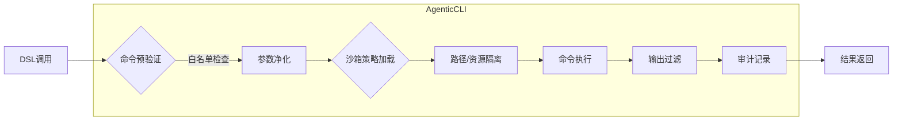

# `/lib/os/**` 命名空间架构设计：安全Shell命令执行体系

> **核心原则**：AgenticCLI **绝不直接暴露原始Shell接口**，而是通过精细化权限控制、多层沙箱隔离、命令白名单机制，提供安全可控的OS能力抽象

## 1. 整体架构概览

```
┌─────────────────────────────────────────────────────────────────┐
│                      /lib/os/** 命名空间                        │
│                                                                 │
│  ┌───────────────┐  ┌───────────────┐  ┌─────────────────────┐  │
│  │ 文件系统操作  │  │ 进程管理操作  │  │ 环境/系统信息操作   │  │
│  │ /lib/os/file_ │  │ /lib/os/exec  │  │ /lib/os/env_*       │  │
│  │ /lib/os/dir_* │  │ /lib/os/process*│ /lib/os/time_get     │  │
│  └───────┬───────┘  └───────┬───────┘  └──────────┬──────────┘  │
│          │                  │                     │             │
│  ┌───────▼──────────────────▼─────────────────────▼─────────┐  │
│  │               OS能力抽象层 (Capability Abstraction)     │  │
│  │  • 统一接口规范 • 参数验证 • 结果标准化                  │  │
│  └───────────────────────────┬──────────────────────────────┘  │
│                              │                                 │
│  ┌───────────────────────────▼──────────────────────────────┐  │
│  │                   沙箱执行引擎 (Sandbox Engine)          │  │
│  │  • 路径隔离 • 系统调用过滤 • 资源限制 • 网络隔离         │  │
│  └───────────────────────────┬──────────────────────────────┘  │
│                              │                                 │
│  ┌───────────────────────────▼──────────────────────────────┐  │
│  │                平台抽象层 (Platform Abstraction Layer)  │  │
│  │  • Linux (seccomp/cgroups) • Windows (Job Objects)     │  │
│  │  • macOS (Sandbox/Seatbelt) • WASM (受限能力)          │  │
│  └──────────────────────────────────────────────────────────┘  │
└─────────────────────────────────────────────────────────────────┘
```

## 2. Shell命令执行核心架构 (`/lib/os/exec`)

### 2.1 安全执行流水线


### 2.2 关键组件详解

#### 2.2.1 命令白名单引擎
```cpp
class CommandWhitelist {
public:
  static bool is_allowed(const std::string& command, 
                        const SecurityContext& ctx) {
    // 1. 基础白名单检查
    if (global_whitelist_.contains(command)) 
      return true;
    
    // 2. 上下文感知动态白名单
    if (ctx.user_role() == "admin" && 
        admin_whitelist_.contains(command)) 
      return true;
    
    // 3. 模式匹配 (安全正则)
    for (const auto& pattern : dynamic_patterns_) {
      if (std::regex_match(command, pattern.safe_regex)) {
        // 4. 权限升级审批
        if (pattern.requires_approval) {
          return ApprovalService::request_approval(
            ctx.session_id(), 
            command,
            pattern.reason
          );
        }
        return true;
      }
    }
    
    return false;
  }

private:
  static const std::unordered_set<std::string> global_whitelist_ = {
    "ls", "cat", "grep", "find", "date", "pwd", "echo"
  };
  
  struct SafePattern {
    std::regex safe_regex;        // 严格限制的正则表达式
    bool requires_approval;       // 是否需要审批
    std::string reason;           // 需要该模式的原因
  };
};
```

#### 2.2.2 安全命令执行器
```cpp
ExecutionResult safe_exec_command(const Params& params, 
                                 const SecurityContext& ctx) {
  // 1. 命令提取与验证
  std::string command = params["command"];
  if (!CommandWhitelist::is_allowed(command, ctx)) 
    return ERR_CMD_NOT_WHITELISTED(command);
  
  // 2. 参数安全处理
  auto safe_args = sanitize_command_args(
    params.value("args", std::vector<std::string>()),
    ctx
  );
  
  // 3. 沙箱执行
  return SandboxEngine::execute_in_sandbox(
    "exec_command",
    params,
    ctx,
    [&]() -> ExecutionResult {
      // 4. 使用posix_spawn避免shell注入 (Linux)
      #if defined(__linux__)
      return execute_with_posix_spawn(command, safe_args, ctx);
      
      // 5. Windows安全执行 (CreateProcess with Job Objects)
      #elif defined(_WIN32)
      return execute_with_create_process(command, safe_args, ctx);
      
      // 6. 默认拒绝
      #else
      return ERR_PLATFORM_NOT_SUPPORTED("exec_command");
      #endif
    }
  );
}
```

#### 2.2.3 敏感数据过滤器
```cpp
class OutputSanitizer {
public:
  static std::string sanitize(const std::string& output, 
                            const SecurityContext& ctx) {
    // 1. 密钥/密码模式过滤
    static const std::vector<std::string> sensitive_patterns = {
      R"(password\s*[=:]\s*[^\s]+)",
      R"(secret\s*[=:]\s*[^\s]+)",
      R"(token\s*[=:]\s*[^\s]+)",
      R"(api[_-]?key\s*[=:]\s*[^\s]+)",
      R"((?i)credential[s]?\s*[=:]\s*[^\s]+)"
    };
    
    std::string sanitized = output;
    for (const auto& pattern : sensitive_patterns) {
      sanitized = std::regex_replace(
        sanitized, 
        std::regex(pattern), 
        "[REDACTED]"
      );
    }
    
    // 2. 路径脱敏 (隐藏绝对路径细节)
    if (!ctx.has_permission("system:debug")) {
      sanitized = std::regex_replace(
        sanitized,
        std::regex(R"(/([a-z0-9_-]+/){2,})"),
        "/[REDACTED]/"
      );
    }
    
    // 3. 自定义组织策略
    return OrganizationPolicy::apply_output_rules(sanitized, ctx);
  }
};
```

## 3. 沙箱安全模型

### 3.1 多层次隔离策略
| 隔离层 | 实现机制 | 保护目标 | 命令执行特定规则 |
|--------|---------|----------|------------------|
| L1: 路径隔离 | chroot/jail, mount namespaces | 文件系统 | 仅允许访问白名单目录，重定向/tmp |
| L2: 系统调用过滤 | seccomp-bpf (Linux), EAF (Windows) | 内核接口 | 禁止execve/fork/ptrace等危险调用 |
| L3: 资源限制 | cgroups (Linux), Job Objects (Windows) | 系统资源 | CPU 5s, 内存256MB, 无后台进程 |
| L4: 网络隔离 | network namespaces, firewall rules | 网络访问 | 默认禁用，需显式授权 |
| L5: 能力限制 | Linux capabilities, privilege dropping | 特权操作 | 无特权，禁用setuid |

### 3.2 Shell命令专用沙箱配置
```json
{
  "profile_name": "command_execution_safe",
  "path_isolation": {
    "allowed_roots": ["/tmp/agentic_cmd", "/usr/bin", "/bin"],
    "forbidden_paths": [
      "/etc/shadow", "/root/.ssh", "/home/*/.ssh", 
      "/proc", "/sys", "/dev"
    ],
    "home_directory": "/tmp/agentic_cmd/home"
  },
  "resource_limits": {
    "cpu_ms": 5000,
    "memory_mb": 256,
    "io_bytes": 10485760,
    "timeout_ms": 10000,
    "max_processes": 1,  // 禁止子进程
    "max_threads": 4
  },
  "system_calls": {
    "allowed": [
      "read", "write", "open", "close", "stat", "fstat", 
      "lseek", "mmap", "munmap", "brk", "exit", "exit_group"
    ],
    "forbidden": [
      "execve", "fork", "vfork", "clone", "ptrace", "mount", 
      "umount", "setuid", "setgid", "chroot", "reboot"
    ]
  },
  "command_restrictions": {
    "shell_injection_prevention": true,  // 禁用shell元字符
    "redirect_stdout_stderr": true,      // 重定向标准输出/错误
    "no_background_processes": true,    // 禁止&后台执行
    "no_pipes": false,                   // 允许管道，但需验证
    "max_argument_length": 1024
  },
  "network": {
    "enabled": false,
    "allowed_hosts": [],
    "allowed_ports": []
  }
}
```

## 4. 权限与审计体系

### 4.1 分级权限模型
```
┌─────────────────────────────────────────────────────────────┐
│                      Shell命令权限层级                      │
│                                                             │
│  ┌─────────────┐  ┌─────────────┐  ┌─────────────────────┐  │
│  │ 基础权限    │  │ 高级权限    │  │ 管理员权限          │  │
│  │ (所有用户)  │  │ (认证用户)  │  │ (系统管理员)        │  │
│  └─────────────┘  └─────────────┘  └─────────────────────┘  │
│       ▲                ▲                  ▲               │
│       │                │                  │               │
│  ┌────┴─────┐    ┌─────┴──────┐    ┌──────┴─────────────┐  │
│  │ /bin/ls  │    │ /usr/bin/* │    │ /* (全系统命令)    │  │
│  │ /bin/cat │    │ /bin/grep  │    │ 需二次审批         │  │
│  │ /bin/date│    │ /bin/find  │    │ 完整审计跟踪       │  │
│  └──────────┘    └────────────┘    └────────────────────┘  │
└─────────────────────────────────────────────────────────────┘
```

### 4.2 审计日志标准
**Shell命令执行必须记录**：
```json
{
  "timestamp": "2025-11-24T12:44:00Z",
  "operation": "/lib/os/exec",
  "session_id": "sess_a1b2c3d4",
  "user_identity": "user@example.com",
  "command": {
    "executable": "grep",
    "arguments": ["-r", "error", "/tmp/logs"],
    "working_directory": "/tmp/agentic_cmd"
  },
  "security_context": {
    "effective_permissions": ["os:safe_command"],
    "sandbox_profile": "command_execution_safe",
    "approval_status": "auto_approved"
  },
  "result": {
    "status": "success",
    "exit_code": 0,
    "output_size_bytes": 1245,
    "execution_time_ms": 234,
    "resource_usage": {
      "cpu_ms": 187,
      "memory_peak_mb": 45,
      "io_bytes": 2048
    }
  },
  "risk_assessment": {
    "sensitivity_level": "medium",
    "data_accessed": ["/tmp/logs"],
    "network_access": false,
    "system_changes": false
  }
}
```

## 5. 跨平台实现策略

### 5.1 平台特定实现
| 平台 | 命令执行机制 | 沙箱技术 | 限制 |
|------|------------|---------|------|
| **Linux** | `posix_spawn` + seccomp | cgroups v2, namespaces | 完整支持 |
| **Windows** | `CreateProcess` + Job Objects | AppContainer, ACLs | 完整支持 |
| **macOS** | `posix_spawn` + sandbox_init | Seatbelt profiles | 完整支持 |
| **WASM** | 通过主机API代理 | 浏览器沙箱 | 仅读取操作 |

### 5.2 统一接口抽象
```cpp
class PlatformCommandExecutor {
public:
  virtual ~PlatformCommandExecutor() = default;
  
  // 平台无关的命令执行接口
  virtual ExecutionResult execute_command(
    const std::string& command,
    const std::vector<std::string>& args,
    const std::unordered_map<std::string, std::string>& env,
    const SandboxProfile& profile,
    int timeout_ms
  ) = 0;
  
  static std::unique_ptr<PlatformCommandExecutor> create_for_current_platform() {
#if defined(__linux__)
    return std::make_unique<LinuxCommandExecutor>();
#elif defined(_WIN32)
    return std::make_unique<WindowsCommandExecutor>();
#elif defined(__APPLE__)
    return std::make_unique<MacOSCommandExecutor>();
#elif defined(__EMSCRIPTEN__)
    return std::make_unique<WasmCommandExecutor>();
#else
    throw std::runtime_error("Unsupported platform for command execution");
#endif
  }
};
```

## 6. 能力清单与安全边界

### 6.1 核心OS命令能力
| 能力路径 | 描述 | 权限要求 | 安全机制 |
|---------|------|---------|----------|
| `/lib/os/exec@v1` | 执行白名单命令 | `os:safe_command` | 命令白名单、参数净化 |
| `/lib/os/exec@v2` | 扩展命令执行 | `os:extended_command` + 审批 | 动态白名单、敏感操作确认 |
| `/lib/os/process_spawn` | 启动受控进程 | `os:process_spawn` | 无后台进程、生命周期绑定 |
| `/lib/os/process_status` | 获取进程状态 | `os:process_status` | 仅限自身启动的进程 |

### 6.2 禁止的操作（明确排除）
- ❌ **原始Shell访问**：禁止直接暴露`/bin/sh`、`cmd.exe`、`powershell.exe`
- ❌ **提权操作**：禁止`sudo`、`su`、UAC提权相关命令
- ❌ **持久化**：禁止写入启动项、计划任务、服务注册
- ❌ **网络渗透**：禁止`nc`、`nmap`、`curl`到非白名单地址
- ❌ **系统修改**：禁止修改`/etc`、注册表、系统配置

## 7. 集成与部署

### 7.1 与DAG Runtime集成
```cpp
// 注册到执行器
extern "C" void agentic_cli_init(ToolRegistry& registry) {
  // 注册安全命令执行能力
  registry.register_tool(
    "/lib/os/exec@v2",
    safe_exec_command_executor,
    ToolMetadata{
      .description = "执行安全验证的shell命令",
      .required_permissions = {"os:safe_command"},
      .input_schema = R"({
        "type": "object",
        "properties": {
          "command": {"type": "string", "description": "要执行的命令"},
          "args": {"type": "array", "items": {"type": "string"}, "default": []},
          "env": {"type": "object", "additionalProperties": {"type": "string"}},
          "working_dir": {"type": "string", "default": "/tmp/agentic_cmd"},
          "timeout_ms": {"type": "integer", "default": 5000},
          "sanitize_output": {"type": "boolean", "default": true}
        },
        "required": ["command"]
      })",
      .output_schema = R"({
        "type": "object",
        "properties": {
          "stdout": {"type": "string"},
          "stderr": {"type": "string"},
          "exit_code": {"type": "integer"},
          "execution_time_ms": {"type": "integer"}
        }
      })",
      .resource_costs = {
        .cpu_ms = 100,
        .memory_mb = 50,
        .io_bytes = 10240
      },
      .security = {
        .sandbox_profile = "command_execution_safe",
        .audit_level = "detailed",
        .requires_approval_for_sensitive = true
      }
    }
  );
}
```

### 7.2 部署架构模式
```
┌─────────────────────────────────────────────────────────────┐
│                      部署模式选择                           │
│                                                             │
│  ┌─────────────────┐  ┌─────────────────┐  ┌───────────────┐│
│  │ 嵌入式模式       │  │ 独立服务模式     │  │ 容器化模式    ││
│  │ (开发/测试)     │  │ (生产环境)      │  │ (云原生)     ││
│  └────────┬────────┘  └────────┬────────┘  └───────┬───────┘│
│           │                    │                   │        │
│  ┌────────▼─────────┐  ┌──────▼─────────────┐  ┌──▼────────┐│
│  │ 与执行器同进程    │  │ gRPC/REST服务      │  │ Docker    ││
│  │ 共享内存          │  │ 网络隔离           │  │ Podman    ││
│  │ 低延迟            │  │ 高安全性           │  │ K8s       ││
│  └──────────────────┘  └────────────────────┘  └───────────┘│
│            ▲                    ▲                   ▲        │
│            │                    │                   │        │
│  ┌─────────┴─────────┐  ┌──────┴─────────────┐  ┌──┴────────┐│
│  │ 适用场景:         │  │ 适用场景:         │  │ 适用场景: ││
│  │ • 简单应用        │  │ • 多租户环境      │  │ • 云环境  ││
│  │ • 无敏感操作      │  │ • 严格隔离需求    │  │ • CI/CD   ││
│  │ • 低延迟要求      │  │ • 合规审计        │  │ • 弹性扩展││
│  └───────────────────┘  └────────────────────┘  └───────────┘│
└─────────────────────────────────────────────────────────────┘
```

## 8. 最佳实践与反模式

### 8.1 推荐实践
- ✅ **命令最小化**：仅注册必需的命令，避免"全能"接口
- ✅ **参数验证**：严格验证每个参数，拒绝未预期的输入
- ✅ **输出净化**：始终启用敏感数据过滤
- ✅ **短期执行**：设置合理的超时，避免长时间运行
- ✅ **审计先行**：所有命令执行必须记录完整上下文

### 8.2 严格避免的反模式
- ❌ **shell注入**：直接拼接用户输入到命令字符串
- ❌ **权限膨胀**：为命令执行授予超出必要的权限
- ❌ **无沙箱执行**：绕过安全上下文直接调用系统命令
- ❌ **全局状态**：在命令执行中保留跨调用状态
- ❌ **完整路径暴露**：在错误消息中泄露系统路径细节

> **总结**：通过`/lib/os/**`命名空间，AgenticCLI提供了一个**安全可控的OS能力抽象层**，特别是对shell命令执行，采用**多层防御**策略：命令白名单 + 参数净化 + 沙箱隔离 + 资源限制 + 审计追踪。这确保了LLM驱动的系统操作既强大又安全，符合企业级安全标准，同时保持了平台无关性和可扩展性。任何实现必须遵循"沙箱优先"原则，绝不在安全验证前执行任何OS操作。
